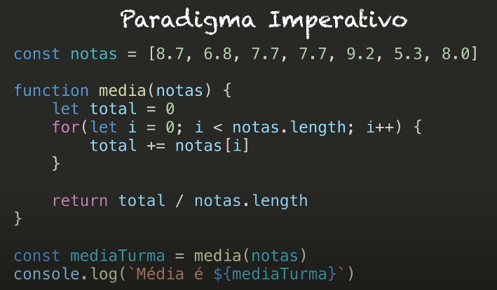
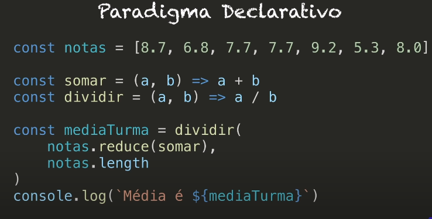

# Functional Programming

## Introduction

> Functional programming is a programming paradigm where programs are constructed by applying and composing functions. It is a declarative programming paradigm in which function definitions are trees of expressions that each return a value, rather than a sequence of imperative statements which change the state of the program or world.

### Pure functions

1. Its return value is the same for the same arguments (no variation with local static variables, non-local variables, mutable reference arguments or input streams from I/O devices).
2. Its evaluation has no side effects (no mutation of local static variables, non-local variables, mutable reference arguments or I/O streams).

```jsx
// no side effects
const array = [1, 2, 3];

function removeLastItem(arr) {
  const newArray = [].concat(arr);
  newArray.pop();
  return newArray;
}

// referential transparency
function a(n1, n2) {
  return n1 + n2;
}
```

## Idempotent

- A function that always returns or does what we expected to do
- Ex: delete a user from database

```jsx
Math.abs(Math.abs(-50));
```

## Imperative x Declarative





## Currying

> currying is the technique of translating the evaluation of a function that takes multiple arguments into evaluating a sequence of functions, each with a single argument.

```jsx
const multiply = (a, b) => a * b;

// currying
const curriedMultiply = (a) => (b) => a * b;

curriedMultiply(5)(2); // 10

const currriedMultiplyBy5 = curriedMultiply(5);
currriedMultiplyBy5(4); // 20
```

## Partial Application

- A way to partially apply a function
- Process of producing a function with a smaller number of parameters —> taking a function applying some of its arguments into the function so it remembers those parameters and then it uses closures to later on be called with all the rest of the arguments

```jsx
const multiply = (a, b, c) => a * b * c;

// curry version
const curriedMultiply = (a) => (b) => (c) => a * b;

// partial version
const partialMultiplyBy5 = multiply.bind(null, 5);
partialMultiplyBy5(2, 5);
```

## Compose and Pipe

- Compose ability is a system design principle that deals with the relationship between components that can be selected and assembled in various combinations.

```jsx
const compose = (f, g) => (data) => f(g(data));

const multiplyBy5 = (num) => num * 5;

const makeAbsolute = (num) => Math.abs(num);

const multiplyBy5andAbsolute = compose(multiplyBy5, makeAbsolute);

multiplyBy5andAbsolute(-20); // 100
```

- Pipe is almost the same think. But it goes left to right

```jsx
const pipe = (f, g) => (data) => g(f(data));

const multiplyBy5 = (num) => num * 5;

const makeAbsolute = (num) => Math.abs(num);

const multiplyBy5andAbsolute = pipe(makeAbsolute, multiplyBy5);

multiplyBy5andAbsolute(-20); // 100
```

## Nice example

- Shopping cart feature

```jsx
const user = {
  name: "leo",
  active: true,
  cart: [],
  purchases: [],
};

const compose = (f, g) => (...args) => f(g(...args));

// factory
purchaseItem(
  emptyCart,
  buyItem,
  applyTaxToItems,
  addItemToCart
)(user, { name: "iphone", price: 300 });

function purchaseItem(...fns) {
  return fns.reduce(compose);
}

function addItemToCart(user, item) {
  const updateCart = user.cart.concat([item]);
  return Object.assign({}, user, { cart: updateCart });
}

function applyTaxToItems(user) {
  const { cart } = user;

  const tax = 1.2;
  const updatedCart = cart.map((item) => {
    return {
      name: item.name,
      price: item.price * tax,
    };
  });

  return Object.assign({}, user, { cart: updatedCart });
}

function buyItem(user) {
  return Object.assign({}, user, { purchases: user.cart });
}

function emptyCart(user) {
  return Object.assign({}, user, { cart: [] });
}
```
