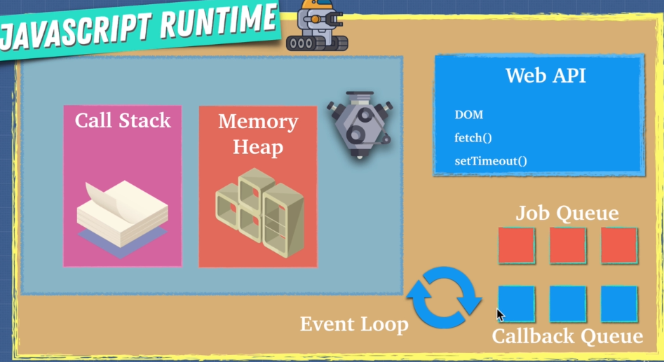

# Job Queue



## Callback queue - task queue

```jsx
setTimeout(() => {
  console.log("hello");
}, 3000);
```

## Job queue - microtask queue

- high priority than the callback queue

```jsx
Promise.resolve("hi").then((data) => console.log(data));
```
