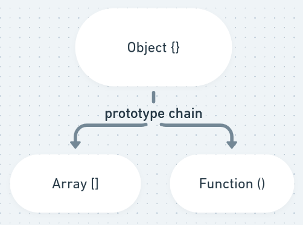
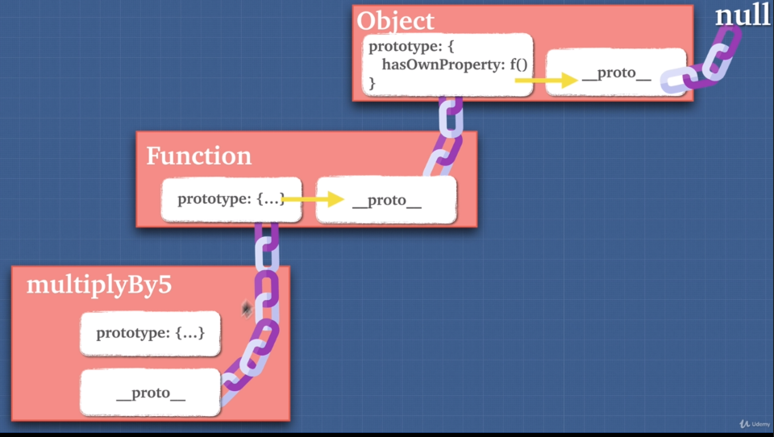
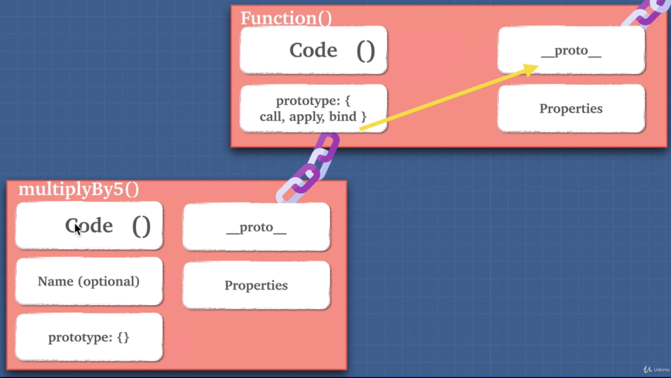

# Prototype

## Prototype Inheritance

- JavaScript uses prototype inheritance
  - Inheritance —> It is an object getting access to the properties and methods of another object.
  - Functions get access to the methods and properties of object

```jsx
const array = [];

array.__proto__;
// [constructor: ƒ, concat: ƒ, copyWithin: ƒ, fill: ƒ, find: ƒ, …]

array.__proto__.__proto__;
// {constructor: ƒ, __defineGetter__: ƒ, __defineSetter__: ƒ, hasOwnProperty: ƒ, __lookupGetter__: ƒ, …}
```



## Example

- Don't use **proto** —> bad for performance and the are other ways to do that.

```jsx
let dragon = {
  name: "Tanya",
  fire: true,
  fight() {
    return 5;
  },
  sing() {
    if (this.fire) {
      return `I am ${this.name}`;
    }
  },
};

let lizard = {
  name: "kiki",
  fight() {
    return 1;
  },
};

lizard.__proto__ = dragon; // create a prototype chain
lizard.sing(); // 'I am lizard'
lizard.fight; // 1
dragon.isPrototypeOf(lizard); // true
```

## Useful ?

- Object can share prototypes means that objects can have properties that are pointing to the same place in memory.

## Tips

> Only functions have the prototype property

- All functions are created from the base function



- We have the pattern **proto** —> prototype
  - It is simply a pointer
  - **proto** is one property of prototype (separated in image just to become easier to understand)



```jsx
multiplyBy5.__proto__;
// f () { [native code] }

Function.prototype;
// f () { [native code] }
```

## Better way of Inherit

```jsx
let human = {
  mortal: true,
};

let leonardo = Object.create(human);

console.log(human.isPrototypeOf(socrates)); // true
```

## Exercise

```jsx
// ex 1
Date.prototype.lastYear = function () {
  return this.getFullYear() - 1;
};

new Date("1997-20-20").lastYear(); // 1996

// ex 2
Array.prototype.map = function () {
  let arr = [];

  for (let i = 0; i < this.legth; i++) {
    arr.push(this[i] + "*");
  }

  return arr;
};

console.log([1, 2, 3].map()); // 1*, 2*, 3*
```
