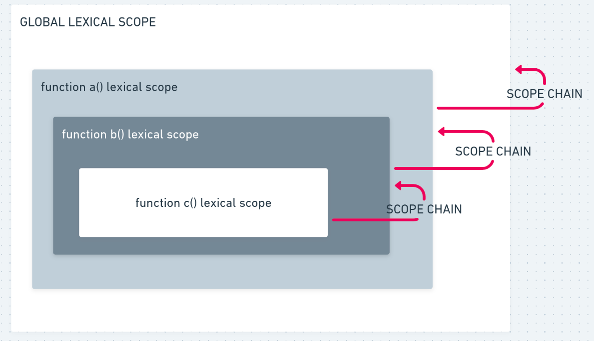

# Scope Chain

## Introduction

When a variable is used in JavaScript, the JavaScript engine will try to find the variable’s value in the current scope. If it could not find the variable, it will look into the outer scope and will continue to do so until it finds the variable or reaches global scope.

If it’s still could not find the variable, it will either implicitly declare the variable in the global scope (if not in strict mode) or return an error.

```jsx
// all function will ahve acces to the global scope
var x = "x";

function name() {
  console.log(x);
}

name();
// x
```

Static scope in a language means that only by looking at the source code we can determine which environment the variables and data are available in. The compiler looks at the code and attaches all these scopes chains before it even runs the code.

> In JavaScript our lexical scope (available data + variables where the function was defined) determines our available variables. Not where the function is called (dynamic scope).

## Function Lexical Scope

```jsx
function a() {
  var a = "a";

  function b() {
    var b = "b";

    console.log(a, b); // ok -> a, b
    // console.log(c) -> will return reference error

    function c() {
      var c = "c";
      console.log(a, b, c); // ok -> a, b, c
    }
  }
}
```


