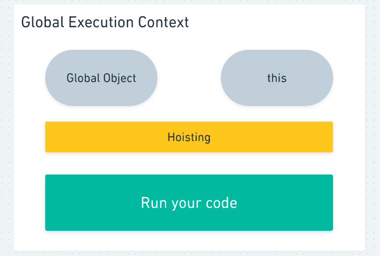

# This keyword - part 1

## Introduction

> Is the object that the function is a property of



- Gives methods access to their object

```jsx
objectX.someFunction(this); // this refers to object objectX

const obj = {
  name: "Leonardo",
  printName() {
    return this.name; // this point to the object obj
  },
};
```

- Execute the same code for multiple objects

```jsx
function logName() {
  console.log(this.name);
}

obj1 = {
  name: "Leonardo",
  logName: logName,
};

obj2 = {
  name: "Joao",
  logName: logName,
};

obj1.logName(); // Leonardo
obj2.logName(); // Joao
```
