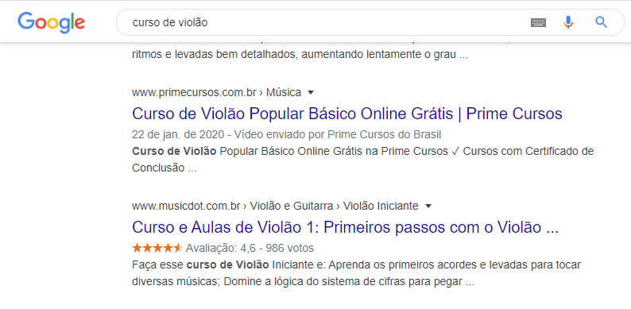

# SEO

Created By: Leonardo Freitas
Last Edited: May 04, 2020 4:06 PM

# Introducao

O termo SEO (Search Engine Optimization) se refere a implementacao de otimizacoes para servicos de busco como o Google. Essa otimizacao pode resultar em aumento da relevancia do conteudo do site para seus usuários, aumento do tráfego e audiencia.

SEO não serve somente para textos, e as técnicas também podem ser aplicadas para vídeos. O Youtube, por exemplo, é uma plataforma muito forte para quem quer trabalhar com SEO hoje, e faz muito sentido manter um canal nesse site linkando com suas páginas de conteúdo. Assim, você manterá o usuário informado e diversificará bastante a sua atuação.

# Glossario

- **Backlinks →** são links em outros domínios que apontam para o seu ou para páginas do seu site, esse é um forte fator de ranqueamento.
- **Call to Action →** É a chamada para um acao, notmalmente em forma de texto. Pode ser um botão "comprar" e outros.
- **Testes A/B →** Duas estruturas diferentes ou com elementos diferentes ou diagramados de forma diferente e você divide seu público entre essas variantes, a fim de entender qual performou melhor.
  - Ex: você tem um e-commerce e quer saber se o usuário prefere ver a página com a foto do produto do lado direito e a descrição à esquerda ou o contrário, para isso você cria as duas variantes, utiliza alguma ferramenta que irá direcionar parte do tráfego para cada delas, e depois, baseado nos dados que obteve com a ferramenta, você define qual a melhor estrutura para os usuários
- **CTR (click-through rate) →** quantidade de cliques em um link dividido pela quantidade de impressões dele, no resultado de busca isso significa: quantas vezes o seu link apareceu no resultado para o usuário e foi clicado.
- **Crawl Budget →** orçamento de rastreio do buscador para varrer o seu site, então ele precisa ser otimizado para que o buscador gaste o menor tempo rastreando seu site e consiga as informações que ele precisa para poder ranquear suas páginas

# Indexacao básica

**Indexação** é o processo no qual o Google coloca as páginas em seu índice para serem entregues aos usuários durante uma busca. Logo, se uma página está indexada, o usuário poderá encontrá-la ao consultar uma palavra-chave.

**OBS: Utilizar o google search console**

### Ver todas as paginas que estão sendo indexadas

Voce pode digitar no google site:dominio_do_site.

Perceba que muitas páginas não precisam ser indexadas.

### Remover uma página da indexacao

Insira a tag noindex no html. Isso também vai ajudar a melhorar o seu **Crawl Budget.**

```html
<meta name="robots" content="noindex" />
```

### Arquitetura URL

Quando pensamos em mudar uma URL, devemos solicitar que um desenvolvedor faça um redirecionamento 301 do antigo endereço para o novo. Esse é um redirecionamento permanente, e ajuda o Google a entender que a página mudou totalmente de endereço e hoje existe me outro formato. Assim, o Google saberá que a página foi alterada e não perdeu relevância, e ela continuará aparecendo nas buscas. Quando mudamos a URL e não fazemos esse redirecionamento, e o Google encontrará primeiro a página mais antiga, deixando de acessar a outra.

# Como os usuários buscam

O usuário possui vários momentos de busca, chamados de "topo do funil", "meio do funil" e "final do funil"

- topo de funil → inicio da pesquisa
- meio de funil → peculiaridades de uma busca
- final de funil → decisao

Uma estratégia boa é ter os 3 níveis de funil na página e sempre pensar na jornada do usuário que já sabe o que quer e o que ainda está indeciso.

### Tempo de carregamento de página

Você pode conferir um relatório no site [https://www.webpagetest.org/](https://www.webpagetest.org/).

# SEO para imagens e vídeos

Feito atraveś das tags:

- alt → utilizar - invés de espaco (google nao entende espaco)
- title
- name
- legend
- src → colocar o nome da imagem de forma que tenha sentido (imagem-de-violao)

Manter imagens com 72dpi para não sobrecarregar o carregamento (100kb pra menos)

# Breadcrumbs

Mostra para o usuário aonde ele se contra e facilita o google saber aonde o usuário está e como ele chegou ali. Se você não colocar o breadcrumb o google normalmente tem um problema de rastreamento, que faz seu site nao ter um SEO bom.

# Canonical tag

Evita conteúdo duplicado → faz com que o Google rastreie duas vezes páginas que podem ser iguais ou muito parecidas.

Portanto, imagine que você tem duas páginas idênticas, mas apenas uma deve ser rankeada. Assim, você consegue atribuir a mesma canonical tag para as duas, mostrando que existe uma versão principal e outra secundária que, por alguma razão, deve ser "ignorada", como um legado de site antigo ou uma página utilizada para teste AB.

# Dados estruturados

Dentro da sua estratégia de SEO, não só é importante ter uma página bem rankeada, como também atrair a atenção do usuário no momento do clique. Uma ótima maneira de fazer isso é com os chamados dados estruturados, que podem ser a avaliacao de uma determinada página



Um exemplo útil:

```html
<div itemscope itemtype="http://schema.org/Product">
    
    <span itemprop=-"name">Dell UltraSharp 30" LCD Monitor</span>
    <div itemprop="aggregateRating"
        itemscope itemtype="http://schema.org/AggregateRaring">
        <span itemprop="ratingValue">87</span>
        out of <span itemprop="bestRating">100</span>
        based on <span itemprop="ratingCount">24</span> user ratings
    </div>
    <div itemprop="offers" itemscope itemtype="http://schema.org/AggregateOffer">
        <span itemprop="lowPrice">$1250</span>
        to <span itemprop="highPrice">$1495</span>
        from <span itemprop="offerCount">8</span> sellers
        Sellers:
        <div itemprop="offers" itemscope itemtype="http://schema.org/Offer">
            <a itemprop="url" href="save-a-lot-monitors.com/dell-30.html">
            Save A Lot Monitors - $1250</a>
        </div>
        <div itemprop="offers" itemscope itemtype="http://schema.org/Offer">
            <a itemprop="url" href="jondoe-gadgets.com/dell-30.html">
            Jon Doe's Gadgets - $1350</a>
        </div>
    </div>
    ...
<div>
```

# Robots

Para garantir que sua estratégia de SEO tenha sucesso, é necessário que o Google consiga rastrear todas as páginas do seu site, certo? Na verdade, existem páginas que não precisam ser rastreadas, como páginas de carrinho, de login ou de pagamento, já que é mais interessante que o usuário encontre as páginas que deseja e, somente ao fim da jornada, proceda para esse tipo de navegação, por exemplo quando estiver adquirindo um produto ou assinando um serviço.

É possível bloquear esse tipo de página por meio de uma ferramenta chamada robots.txt, um arquivo de robôs em formato de texto que direciona ao buscador aquilo que deve ser rastreado ou não.

```
User-Agent: *
Disallow: /_
Disallow: /admin/
Disallow: /paypal
Disallow: /pagamento-cancelado
Disallow: /contato-enviado
Disallow: /newsletter-cadastrado
Disallow: /compra
Allow: /
```

# Sitemap.xml

Informa como as páginas devem ser rastreadas e atua em conjunto com o robots.txt

```xml
</xml version="1.0" encoding="UTF-8"?>
<urlset xmlns="http://www.sitemaps.org/schemas/sitemap/0.9">
    <url>
     <loc>http://www.example.com/</loc>
    </url>
    <url>
     <loc>http://www.example.com/about.html</loc>
     <lastmod>2009-01-27</lastmod>
     <changefreq>monthly</changefreq>
     <priority>0.9</priority>
    </url>
</urlset>
```

# Mensurar o SEO

O primeiro passo é analisar os relatórios de cobertura e de rastreamento do Search Console, que apresentam resultados mais rapidamente. Neles, a quantidade de URLs válidas precisa aumentar, e de URLs excluídas precisa diminuir.

Nessa etapa, também é importante identificar se estão surgindo URLs válidas com erros. Nessa situação, devemos entender o quanto ela está impactando a nossa estratégi, afinal, se temos um link para uma página errada, estamos impedindo a navegação correta, e tanto o Google quanto os usuários terão dificuldades em encontrar as páginas via linkagem interna.

Outro relatório que reflete resultados em um tempo mais curto é o do sitemap. Isso porque, ao enviarmos o arquivo sitemap.xml para o SearchConsole, ajudamos o Google a rastrear as nossas URLs e conseguimos acompanhar a data da última leitura e a data do envio, de modo a entendermos a frequência do rastreamento e identificação das páginas.
