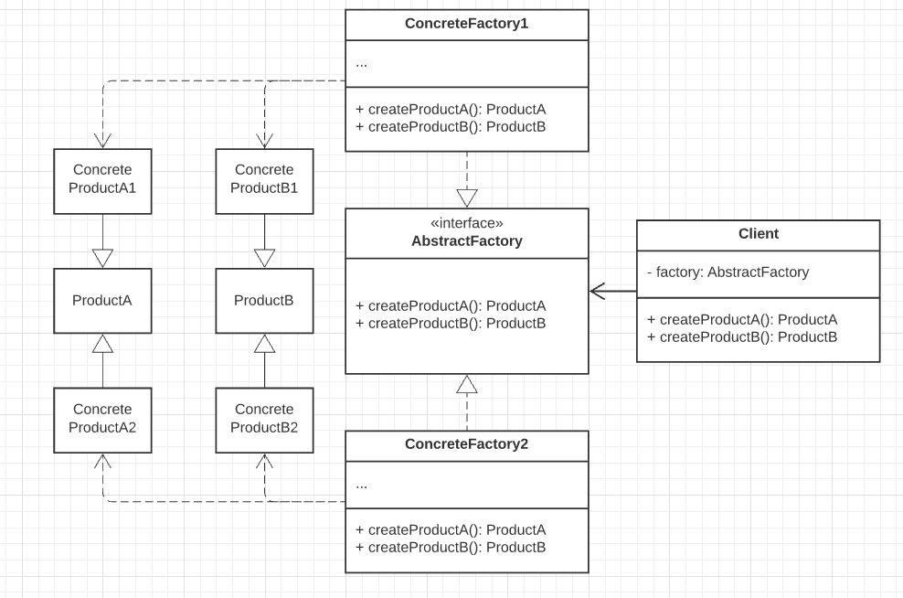

# Abstract Factory

**Abstract factory is a creational design pattern that lets you produce families of related objects without 
specifying their concrete classes**

## Problem

Imagine that we are creating a furniture shop simulator. The code consists of classes that represent:

1. A family of related products (chair, sofa, coffeeTable)
2. Several variants of their family (modern, victorian, artDeco)

The code need a way to create individual furniture objects so that they match other objects of the same family.

## Solution

- Explicitly declare interfaces for each distinct product of the product family. hen make all variants of products 
  follow those interfaces.
- Declare the ```AbsctractFactory``` interface with a list of the creation methods for all products that are part of 
  the product family. These methods must return **abstract** products.
- For each variant of a product family, create a separate factory class based on the ```AbstractFacotry``` interface.


### Achievements

1. The product code works with both factories and products via their respective abstract interfaces.
2. It is possible to change the type of factory that you pass to the client code, as well as the product variant 
   that the client code receives, without breaking the actual client code.

## Structure   

1. **Abstract Products** --> Declare interfaces for a set of distinct but related products which make up a product 
   family.
2. **Concrete Products** --> Various implementations of abstract products, grouped by variants. Each abstract product 
   must be implemented in all given variants.
3. **Abstract Factory** --> Interface declares a set of methods for creating each of the abstract products. 
3. **Concrete Factory** --> Implement creation methods of the abstract factory.



## Applicability

- The code needs to work with various families of related products, but you don't want it to depend on the concrete 
  classes of those products
- It is useful when there is a class with a set o Factory Methods that blur its primary responsibility

## How to implement

1. Map out a matrix of distinct products types versus variants of these products
2. Declare abstract product interfaces for all product types. Make all concrete product classes implement these 
   interfaces
3. Declare the abstract factory interface with a set of creation methods for all abstracts products
4. Implement a set of concrete factory classes, one for each product variant
5. Create factory initialization code somewhere in the app. It should instantiate one of the concrete factory 
   classes. Pass this factory object to all classes that construct products
6. Scan through the code and find all direct calls to product constructors. Replace them with calls to the 
   appropriate creation method on the factory object

## Pros and Cons

1. All products that you get from the factory are compatible
2. Avoid tight coupling between concrete products and client code
3. Single Responsibility Principle
4. Open/Close Principle
5. Increase code complexity


