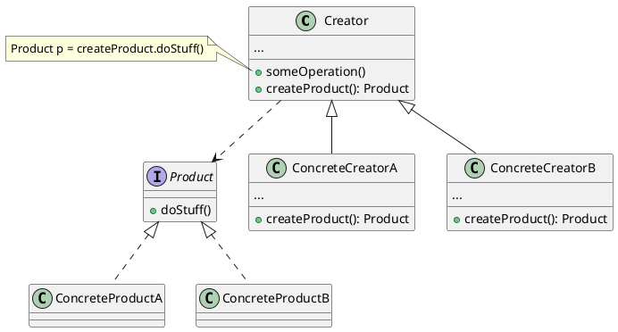

# Factory Method

**Factory method is a creational design pattern that provides an interface for creating objects in a superclass but
allows subclasses to alter the type of objects that will be created**

## Solution

The pattern suggests that you replace direct objection construction calls with calls to a special _factory_ method. As
long as all product classes implement a common interface, it is possible to pass their objects to the client code
without breaking it.

**Limitations**:

- Subclasses may return different types of products only if these products have a common base class or interface
- The factory method in the base class should have its return type declared as this interface

## Structure



## Code Example

```java
public interface Product {
    void doStuff();
}

public class ConcreteProductA implements Product {
    public void doStuff() {
        System.out.println("do stuff for A");
    }
}

public class ConcreteProductB implements Product {
    public void doStuff() {
        System.out.println("do stuff for B");
    }
}

public abstract class Creator {

    public void someOperation() {
        System.out.println("some operation");
    }

    public abstract Button createProduct();
}

public class ConcreteCreatorA extends Creator {

    @Override
    public Button createProduct() {
        return new ConcreteProductA();
    }
}

public class ConcreteCreatorB extends Creator {

    @Override
    public Button createProduct() {
        return new ConcreteProductB();
    }
}

class Main {
    private static Creator creator;

    public static void main(String[] args) {
        configure();
        runBusinessLogic();
    }

    static void configure() {
        int num = random.nextInt(10 - 1 + 1) + 1;

        if (num >= 5) {
            creator = new ConcreteCreatorA();
        } else {
            creator = new ConcreteCreatorB();
        }
    }

    static void runBusinessLogic() {
        creator.someOperation();
    }
}
```

## Applicability

- Don't know beforehand the exact types and dependencies of the objects your code should work with
- Want to provide users of your code with a way to extend its internal components
- Want to save system resources by reusing existing objects instead of rebuilding them each time

## How to implement

1. Make all products follow the same interface. This interface should declare methods that make sense in every product
2. Add an empty factory method inside the creator class. The return type of the method should match the common product
   interface
3. In the creator's code find all references to product constructors. One by one, replace them with calls to the factory
   method, while extracting the product creation code into the factory method
4. Create a set of creator subclasses for each type of product listed in the factory method. Override the factory method
   in the subclasses and extract the appropriate bits of construction code from the base method
5. If there are too many products types, and it doesn't make sense to create subclasses for all of them, you can use the
   control parameter from the base class in subclasses.
6. After the extractions, the base factory method has become empty, you can make it abstract. If there's something left,
   make it a default behavior of the method.

## Pros and Cons

- ++ Avoid tight coupling between the creator and the concrete products
- ++ Single responsibility principle
- ++ Open/Close principle
- -- Code become more complicated


