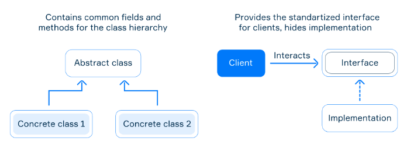

# Abstract class vs interface

Abstract class and interface are both tools to achieve abstraction that allow us to declare the abstract methods.

## Differences

- an **abstract class** can have *abstract* and *non-abstract* instance methods while an **interface** can have *abstract* or *default* instance methods;
- an **abstract class** can extend another abstract or regular class and an **interface** can only extend another interface;
- an **abstract class** can extend only one class while an **interface** can extend any number of interfaces;
- an **abstract class** can have *final*, *non-final*, *static*, *non-static* *variables* (regular fields) while an interface can only have *static final variables*;
- an **abstract class** can provide an implementation of an interface but an **interface** cannot provide an implementation of an abstract class;
- an **abstract class** can have a constructor and an **interface** cannot;
- in an **abstract class**, the keyword `abstract` is mandatory to declare a method as an *abstract* one while in an **interface** this keyword is optional.

### Important

> **Remember, a class extends another class, a class implements an interface, but an interface extends another interface.**

Typically, interfaces are used to decouple the interface of a component (class) from the implementation while abstract classes are often used as base classes with common fields to be extended by subclasses.



### Code Example

```java
interface ManagedDevice {
 
    void on();
 
    void off();
}
 
abstract class AbstractDevice implements ManagedDevice {
 
    protected String serialNumber;
    protected boolean on;
    
    public AbstractDevice(String serialNumber) {
        this.serialNumber = serialNumber;
    }
 
    protected void setOn(boolean on) {
        this.on = on;
    }
}
 
class Kettle extends AbstractDevice {
 
    protected double volume;
 
    public Kettle(String serialNumber, double volume) {
        super(serialNumber);
        this.volume = volume;
    }
 
    @Override
    public void on() {
        // do complex logic to activate all electronic components
        setOn(true);
    }
 
    @Override
    public void off() {
        // do complex logic to stop all electronic components
        setOn(false);
    }
}
```