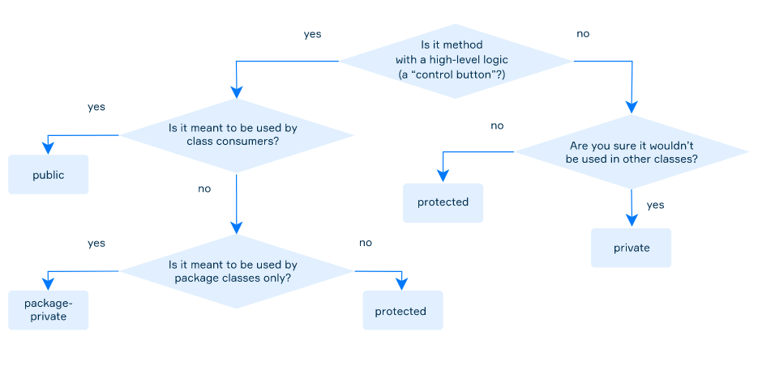
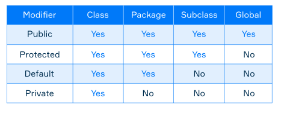

# Access modifiers

Access modifier is a special keyword that specifies who is allowed to use your code or a special part of it. It can be placed in front of any field, method or entire class.

## Why

- Code clarity →We can hide the complexity from the user by restricting access and simply provide them with the public solutions.
- Code safety → Ensure that code works as it is expected.

## Public and package-private classes

A top-level class (not an inner one, not a nested one) can have one of two following modifiers:

- **package-private (default, no explicit modifier):** visible only for classes from the same package;
- **public:** visible to all classes everywhere.

The common way of using top-level class modifiers is:

1. make the classes, containing exact methods for the users **public**;
2. make all other classes with low-level logic methods, used by public ones, **package-private** (cover the engine with the body).

## Private members

Fields are often declared private to control access to them from any other class. In some cases, these fields are only used internally in the class and there is no way to change and even access them from any other class. In other cases, it can be done via accessor methods (e.g. getters and setters).

```java
public class Counter {
   private long current = 0;

   public long getCurrent() {
       return current;
   }


   public long inc() {
       inc(1L);
       return current;
   }


   private void inc(long val) {
       current += val;
   }
}
```

## Package-private members

A package-private access modifier does not require any keyword. If a field, a method or a constructor has this modifier then it can be read or changed from any class inside the same package.

## Summary

- **private** — available only inside a class;
- **package-private** (also known as **default**, implicit) — available for all classes in the same package;
- **protected** — available for classes in the same package and for subclasses (will be covered later);
- **public** — available for all classes everywhere.




