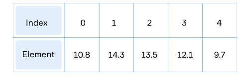

# Array

## Introduction to Array

When you need to process multiple objects of the same type, you can save them in an array and then process together as a single unit.

You may consider an **array** as a collection of elements of the same type. All elements are stored in the memory sequentially.

The collection provides one name for its elements. The possible number of elements to be stored is established when the array is created and cannot be changed. But a stored element can be modified at any time.



### Important

- an array is a reference type;
- all array's elements are stored in the memory sequentially ;
- each element of the array is accessed by its numerical index, the first element has the **index 0**;
- the last element is accessed by the index equal to **array size – 1**;
- it is possible to create an array to store elements of any type.

## Declaration, Instantiation, Initialization

- declare a variable of an array type **(declaration);**
- create an instance of the array object **(instantiation)**;
- initialize the array by some values **(initialization)**.

## Creating an array

The most general way to create an array is to use the special keyword new and specify the necessary number of elements:

```java
int n = ...; // n is a length of an array
int[] numbers = new int[n];

int[] numbers; // declaration
numbers = new int[n]; // instantiation and initialization with default values

float[] floatNumbers; // declaration
floatNumbers = new float[] { 1.02f, 0.03f, 4f }; // instantiation and initialization
```

## Length and accessing elements

```java
int length = array.length; // number of elements of the array

// set value
array[index] = val;
// get value
val = array[index];
```

## The utility class Arrays

If you need to process arrays, you can use standard methods grouped in the utility class Arrays.

- convert array to string using `Arrays.toString(array)` and then print it:

```java
byte[] famousNumbers = { 0, 1, 2, 4, 8, 16, 32, 64 };
String arrayAsString = Arrays.toString(famousNumbers); // [0, 1, 2, 4, 8, 16, 32, 64]
System.out.println(arrayAsString);

```

- sorting a whole array or a part of it using `Arrays.sort(array)`:

```java
long[] bigNumbers = { 200000000L, 400000000L, 100000000L, 300000000L }; // it's unsorted
 
Arrays.sort(bigNumbers); // sorting whole array
 
System.out.println(Arrays.toString(bigNumbers)); // [100000000, 200000000, 300000000, 400000000]

```

- comparing arrays: two arrays are equal if they contain the same elements in the same order:

```java
int[] numbers1 = { 1, 2, 5, 8 };
int[] numbers2 = { 1, 2, 5 };
int[] numbers3 = { 1, 2, 5, 8 };
 
System.out.println(Arrays.equals(numbers1, numbers2)); // it prints "false"
System.out.println(Arrays.equals(numbers1, numbers3)); // it prints "true"

```

- filling a whole array or a part of it by some values:

```java
int size = 10;
char[] characters = new char[size];
 
// It takes an array, start index, end index (exclusive) and the value for filling the array
Arrays.fill(characters, 0, size / 2, 'A'); 
Arrays.fill(characters, size / 2, size, 'B');
 
System.out.println(Arrays.toString(characters)); // it prints [A, A, A, A, A, B, B, B, B, B]

```

### More array methods

[here](https://docs.oracle.com/javase/8/docs/api/java/util/Arrays.html)
