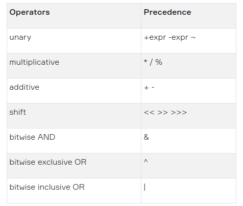

# Bitwise and bit-shift

## Bitwise

There are four bitwise operators: ~ (bitwise NOT, inversion, complement), | (bitwise OR), & (bitwise AND) and ^ (bitwise XOR). Each of these operators goes though all bits of both operands (numbers) one by one (i.e. bitwise) and produces a new number as a result.

- ~ is a unary operator that inverses bits in the binary format of the number making every 0 a 1 and every 1 a 0. It also changes the sign bit of the value.
- | is a binary operator that performs bitwise OR: the result digit is 1 if at least one operand digit is 1, otherwise, it is 0;
- & is a binary operator that performs bitwise AND: the result digit is 1 if both operand digits are 1, otherwise, it is 0;
- ^ is a binary operator that performs bitwise XOR: the result digit is 1 if exactly one operand is 1, otherwise, it is 0

> The listed operators can be applied to integer and boolean operands. If both operands are integers then bitwise operations will be performed. If both operands are booleans, they perform the corresponding logical operations (except ~).

```java
int first = 15;  // binary format 1111
int second = 10; // binary format 1010

int bitwiseAnd = first & second; // 1111 & 1010 = 1010, the result is 10
int bitwiseOr = first | second;  // 1111 | 1010 = 1111, the result is 15
int bitwiseXor = first ^ second; // 1111 ^ 1010 = 0101, the result is 5
```

## Bit-shift

There are three bit-shift operators:

- << is a signed bit-shift operator that shifts a bit pattern to the left by the distance specified in the right operand. It fills the empty place with zeros;
- \>> is a signed bit-shift operator that shifts a bit pattern to the right by the distance specified in the right operand. It fills the empty place with the values of the sign bit.
- \>>> is an unsigned bit-shift operator that shifts a bit pattern to the right by the distance specified in the right operand. It is almost like >>, but shifted values are filled up with zeros. The result of the >>> operator is always positive.

```java
int val = 25;   // binary: 0001 1001, decimal: 25

val = val << 1; // binary: 0011 0010, decimal: 50
val = val << 2; // binary: 1100 1000, decimal: 200

int anotherVal = 14;   // binary: 1110, decimal: 14
anotherVal = anotherVal >> 1; // binary: 0111, decimal: 7

int newVal = 25;

newVal = newVal << 1; // 25 * 2^1 = 50
newVal = newVal << 3; // 50 * 2^3 = 400
newVal = newVal >> 2; // 400 / 2^2 = 100

int left = 10;
int right = 20;

int mid = left + right >> 1; // this is 15!
```

> As you can see, the result of the left-shift operator << is equivalent to the multiplication by two, and the result of the right-shift operator is equivalent to the division by two. Let's generalize: when we use signed bit-shift operators we perform the multiplication or division of the left operand by the 2 in the power of right operand.

## Precedence

When the operators have equal precedence, another rule is used that determines whether the evaluation should be performed from left to right or vice versa. It is called associativity.


