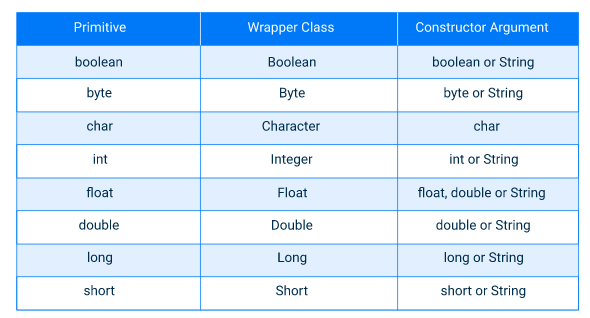

# Boxing and Unboxing

Each primitive type has a class dedicated to it. These classes are known as wrappers, and they are immutable (just like strings).

Wrapper classes can be used in different situations:

- when a variable can be `null` (absence of a value);
- when you need to store values in generic collections (will be considered in the next topics);
- when you want to use special methods of these classes.



## Introduction

- **Boxing** is the conversion of primitive types to objects of corresponding wrapper classes.
- **Unboxing** is the reverse process
- **Autoboxing** and **auto-unboxing** are automatic conversions performed by the Java compiler

```java
int primitive = 100;
Integer reference = Integer.valueOf(primitive); // boxing
int anotherPrimitive = reference.intValue();    // unboxing

double primitiveDouble = 10.8;
Double wrapperDouble = primitiveDouble; // autoboxing
double anotherPrimitiveDouble = wrapperDouble; // auto-unboxing
```

> Autoboxing works only when the left and the right parts of an assignment have the same type. In other cases, you will get a compilation error.

### Primitive types vs Wrapper classes

- processing values of primitive types is faster than processing wrapper objects;
- wrappers can be used when you need `null` as a no-value indicator;
- primitive types cannot be used in standard collections (like lists, sets, or others), but wrappers can.