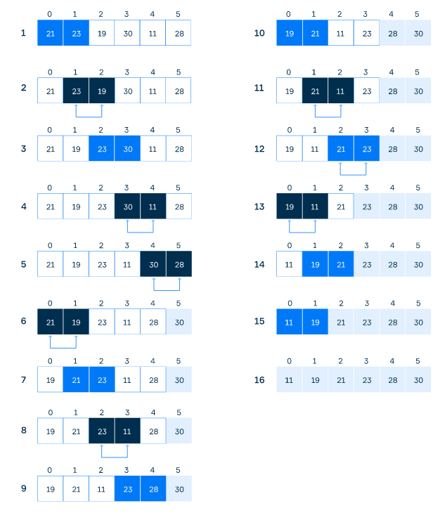

# Bubble Sort

- One of the simplest sorting algorithms
- Repeatedly goes through the array to be sorted, compares each pair of adjacent elements and swaps them if they are in the wrong order.
- **Complexity:** O(n^2)
- **Stable algorithm** → it doesn't change the relative order of identical elements

## Example



## Pseudocode

- List is an array of n elements.
- Swap function swap the values of the given array elements

```java
for i from 1 to N
	for j from 0 to N-1
		if a[j]>a[j+1]
		  swap(a[j], a[j+1])
```

- Improved version → track swaps. If no element was swapped, the array is sorted

```java
func bubblesort2( var a as array )
    for i from 2 to N
        swaps = 0
        for j from 0 to N - 2
           if a[j] > a[j + 1]
              swap( a[j], a[j + 1] )
              swaps = swaps + 1
        if swaps = 0
            break
end func
```

- Improved version → At the end of the i-th pass, the last i numbers are already in place. Test with {3, 9, 1, 7}.

```java
func bubblesort3( var a as array )
    for i from 1 to N
        swaps = 0
        for j from 0 to N - i
           if a[j] > a[j + 1]
              swap( a[j], a[j + 1] )
              swaps = swaps + 1
        if swaps = 0
            break
end func
```

### Implementation

- [Gist](https://gist.github.com/LeoPFreitas/753e9f15107ce700dbc23eda80768419)