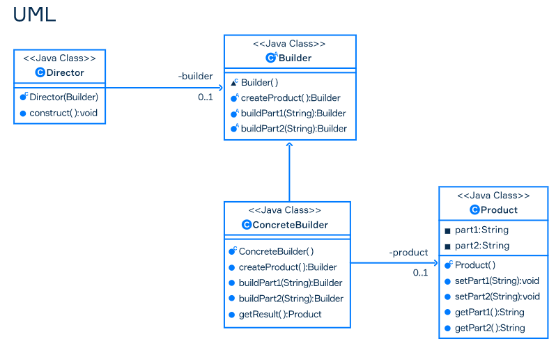

# Builder Pattern

- Creational pattern used to separate complex object construction from its representation
- It can be used to create objects with a specified structure step-by-step
- It avoid the constructor pollution



The builder pattern has the following components:

- **Builder** interface describes the steps of product construction. Each complex object requires the service of a 
**Builder** class to generate object instances.
- **ConcreteBuilder** implements **Builder** to make the required representation of the product. It will construct and
 assemble the parts of the final product and provide the interface to retrieve it. This is the main component that keeps track of the specific representation of the product.
- **Director** manages the object creation process using the **Builder** class, and it will not directly create and
 assemble the final complex object.
- **Product** is the complex object constructed using the concrete builder class which contains the final user
-requested representation.

### Code example

```java
class AlertDialog {
    private String title;
    private String text;
    private String applyButton;
    private String cancelButton;

    private AlertDialog(String title, String text, String applyButton, String cancelButton) {
        this.title = title;
        this.text = text;
        this.applyButton = applyButton;
        this.cancelButton = cancelButton;
    }

    @Override
    public String toString() {
        String str = "";
        if (title != null) {
            str += "The title is: \"" + title + "\"\n";
        }
        if (text != null) {
            str += "The text is: \"" + text + "\"\n";
        }
        if (applyButton != null) {
            str += "The applyButton is: \"" + applyButton + "\"\n";
        }
        if (cancelButton != null) {
            str += "The cancelButton is: \"" + cancelButton + "\"\n";
        }

        return str;
    }

    static class Builder {
        private String title;
        private String text;
        private String applyButton;
        private String cancelButton;

        Builder() {}

        Builder setTitle(String title) {
            this.title = title;
            return this;
        }

        Builder setText(String text) {
            this.text = text;
            return this;
        }

        Builder setApplyButton(String applyButton) {
            this.applyButton = applyButton;
            return this;
        }

        Builder setCancelButton(String cancelButton) {
            this.cancelButton = cancelButton;
            return this;
        }

        AlertDialog build() {
            return new AlertDialog(title, text, applyButton, cancelButton);
        }
    }
}

class TestDrive {
    public static void main(String[] args) {

        AlertDialog twoButtonsDialog = new AlertDialog.Builder()
                .setTitle("Two buttons dialog")
                .setText("You can use either `Okay` or `Cancel`")
                .setApplyButton("Okay")
                .setCancelButton("Cancel")
                .build();

        System.out.println(twoButtonsDialog);

        AlertDialog oneButtonsDialog = new AlertDialog.Builder()
                .setTitle("One button dialog")
                .setText("You can use `Close` only")
                .setCancelButton("Close")
                .build();

        System.out.println(oneButtonsDialog);
    }
```