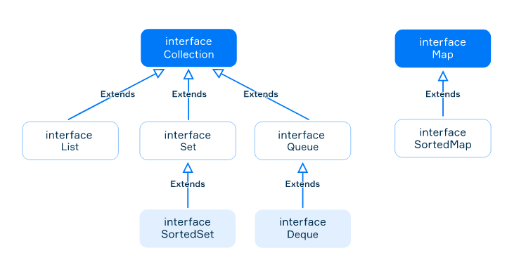

# Collections Framework

## Collections Framework overview

- Java provides the Collections Framework which consists of classes and interfaces for commonly reusable data structures such as lists, dynamic arrays, sets and so on.
- Unified architecture for representing and manipulating collections, enabling collections to be used independently of implementation details ("via its interfaces").

### Includes

- interfaces that represent different types of collections;
- primary implementations of the interfaces;
- legacy implementations from earlier releases (known as "old collections");
- special-purpose implementations (like immutable collections);
- algorithms represented by static methods that perform useful operations on collections.

## Commonly used interfaces

- Generic interfaces: `Collection<E>` and `Map<K, V>`



### Collections<E>

- Represents an abstract collection itself, which is a container for objects of the same type of collections
- Provides common methods for all other types of collections
- The interfaces `List<E>`, `Set<E>`, `Queue<E>`, `SortedSet<E>`, and `Deque<E>` represent different types of collections.
- **Cannot directly create an object of them since they are just interfaces.**

### Map<K, V>

- Represents a map (or dictionary) for storing key-value pairs where `K` is the type of keys and `V` is the type of stored values.
- The `Map<K,V>` interface is not a subtype of the `Collection` interface, but maps are often considered as collections since they are part of the Collection Framework and have similar methods.

## Collection Interface

Common methods provided by the `Collection` interface.

- `int size()` returns the number of elements in this collection;
- `boolean isEmpty()` returns `true` if this collection contains no elements;
- `boolean contains(Object o)` returns `true` if this collection contains the specified element;
- `boolean add(E e)` adds an element to the collection. Returns `true`, if the element was added, else returns `false`;
- `boolean remove(Object o)` removes a single instance of the specified element;
- `boolean removeAll(Collection<?> collection)` removes elements from this collection that are also contained in the
 specified collection;
- `void clear()` removes all elements from this collection.

### Example

- It is impossible to get an element by index via the Collection interface because it is very abstract and does not provide such a method.

```java
Collection<String> languages = new ArrayList<>();

languages.add("English");
languages.add("Deutsch");
languages.add("Français");

System.out.println(languages.size()); // 3
```

> Elements in the ArrayList is anyway preserved. We simply cannot call the get method via the Collection interface.

## Mutable and Immutable Collections

- All collections can be divided into two large groups: mutable and immutable.
- They both implement the `Collection<E>` interface, but immutable collections will throw `UnsupportedOperationException` when trying to invoke some methods which change them: for example, `add`, `remove`, `clear`.

### Iterating

```java
for (String lang : languages) {
    System.out.println(lang);
}

languages.forEach(System.out::println); // with method reference
languages.forEach(elem -> System.out.println(elem)); // with lambda expression
```

### Removing

```java
languages.remove("Deutsch");
System.out.println(languages.size()); // 2

languages.removeIf(lang -> lang.startsWith("E")); // it removes English
System.out.println(languages.size()); // 1
```