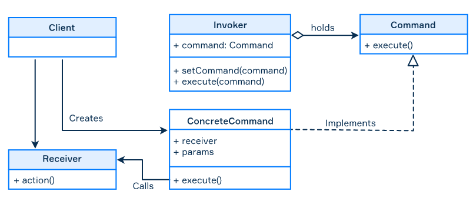

# Command Pattern

- Behavioral pattern -> concerned about the interaction of objects.
- The purpose of the command pattern is to decouple the logic between command and its consumers
- "Encapsulate all the data related to command in one object" -> set of methods, their parameters, and one or more
 objects (Receiver) which these methods belong to.
- The important point about decoupling is if you had to change any of these values, you only have to change one class.

## Classic version

The classic version of the **Command** pattern has the following elements:

- The **Command** interface usually declares just a single method for executing the command.
- The **ConcreteCommand** is an operation with parameters that pass the call to the receiver; In the classic approach
, a command only invokes one or more methods of a *Receiver* rather than perform business logic.
- The **Receiver** knows how to perform the action.
- The **Invoker** asks the command to carry out the request.
- The **Client** creates a **ConcreteCommand** object and sets the *Receiver*.

Note that the interface Command is not necessarily an interface as a language's construct. It can be a simple or abstract class. The main thing is that it represents an abstract command that is inherited by concrete commands.



The Client creates an object of Receiver and a ConcreteCommand and sets up the Invoker to execute the command. Each type of ConcreteCommand (e.g. CreateFileCommand, RemoveFileCommand) has a set of fields which represent the params. A command calls one or more methods of the Receiver to execute concrete actions to change the state of the application.

## Example

```java
public interface Command {
    void execute();
}

public class LightOnCommand implements Command {

    private Light light;

    public LightOnCommand(Light light) {
        this.light = light;
    }

    @Override
    public void execute() {
        light.lightOn();
    }
}

public class LightOffCommand implements Command {

    private Light light;

    public LightOffCommand(Light light) {
        this.light = light;
    }

    @Override
    public void execute() {
        light.lightOff();
    }
}

// receiver
public class Light {

    public void lightOn() {
        System.out.println("Turn on Light");
    }

    public void lightOff() {
        System.out.println("Turn off Light");
    }
}

// invoker
public class Controller {

    private Command command;

    public void setCommand(Command command) {
        this.command = command;
    }

    public void executeCommand() {
        command.execute();
    }
}

public class HomeAutomationDemo {

    public static void main(String[] args) {

        Controller controller = new Controller();
        Light light = new Light();

        Command lightsOn = new LightOnCommand(light);
        Command lightsOff = new LightOffCommand(light);

        controller.setCommand(lightsOn);
        controller.executeCommand();

        controller.setCommand(lightsOff);
        controller.executeCommand();
    }
}

```

### Additional options

The Command pattern can be used together with the following options:

- adding commands to a queue to execute them later;
- supporting undo/redo operations;
- storing a history of commands;
- serializing commands to store them on a disk;
- assembling a set of commands into a single composite command known as **macros.**

### Applicability

- **GUI buttons and menu items.** In Swing programming, an *Action* is a command object. In addition to the ability to
 perform the desired command, an Action may have an associated icon, a keyboard shortcut, tooltip text, and so on.
- **Networking.** It is possible to send whole command objects across the network to be executed on the other
 machines: for example, player actions in computer games.
- **Transactional behavior.** Similar to *undo*, a database engine or software installer may keep a list of operations
 that have been or will be performed. Should one of them fail, all others can be reversed or discarded (this is
  usually called **rollback**).
- **Asynchronous method invocation.** In multithreading programming, this pattern makes it possible to run commands
 asynchronously in the background of an application. In this case, the Invoker is running in the main thread and sends the requests to the Receiver which is running in a separate thread. The invoker will keep a queue of commands and send them to the receiver while it finishes running them.