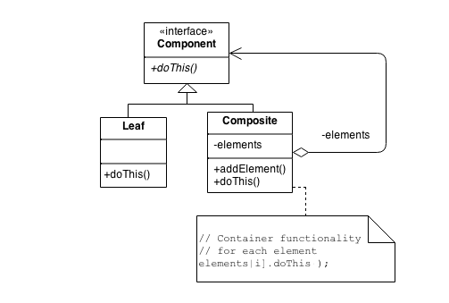

# Composite

### **Objective**

- Compose objects into tree structures to represent hierarchies → through recursive composition
- "1-to-many "has a" up the "is a" hierarchy"

### **What problem it solves?**

It tries to solve the problem of manipulation hierarchical collections of primitive and composite objects. When the
 composite object must be treated different from the primitive object.

We could always query the type of each object, but it is not desirable.

### Use cases

- Menus that contain menu items, each of which could be a menu.
- Row-column GUI layout managers that contain widgets, each of which could be a row-column GUI layout manager.
- Directories that contain files, each of which could be a directory.
- Containers that contain Elements, each of which could be a Container.

## The pattern checklist

- Heuristic: "Containers that contain containers, each of which could be a container"



### Example

```java
// Define a "lowest common denominator"
interface AbstractFile {
    void ls();
}

// File implements the "lowest common denominator"
class File implements AbstractFile {
    private String name;

    public File(String name) {
        this.name = name;
    }

    public void ls() {
        System.out.println(CompositeDemo.compositeBuilder + name);
    }
}

// Directory implements the "lowest common denominator"
class Directory implements AbstractFile {
    private String name;
    private ArrayList includedFiles = new ArrayList();

    public Directory(String name) {
        this.name = name;
    }

    public void add(Object obj) {
        includedFiles.add(obj);
    }

    public void ls() {
        System.out.println(CompositeDemo.compositeBuilder + name);
        CompositeDemo.compositeBuilder.append("   ");
        for (Object includedFile : includedFiles) {
            // Leverage the "lowest common denominator"
            AbstractFile obj = (AbstractFile) includedFile;
            obj.ls();
        }
        CompositeDemo.compositeBuilder.setLength(CompositeDemo.compositeBuilder.length() - 3);
    }
}

public class CompositeDemo {
    public static StringBuffer compositeBuilder = new StringBuffer();

    public static void main(String[] args) {
        Directory music = new Directory("MUSIC");
        Directory scorpions = new Directory("SCORPIONS");
        Directory dio = new Directory("DIO");
        File track1 = new File("Don't wary, be happy.mp3");
        File track2 = new File("track2.m3u");
        File track3 = new File("Wind of change.mp3");
        File track4 = new File("Big city night.mp3");
        File track5 = new File("Rainbow in the dark.mp3");
        music.add(track1);
        music.add(scorpions);
        music.add(track2);
        scorpions.add(track3);
        scorpions.add(track4);
        scorpions.add(dio);
        dio.add(track5);
        music.ls();
    }
}
```