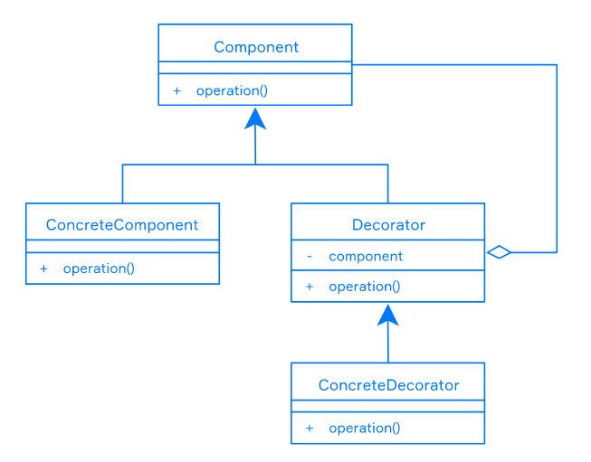

# Decorator

- Sometimes it is necessary to impose additional responsibilities on a separate object rather than the whole class.
- The Decorator is a structural pattern used to add new responsibilities to an object dynamically without extending functionality.

Decorators are used for adding some behavior that is not part of the core functionality to all interface methods. Decorator pattern perfectly suits for the following tasks:

- caching the work results;
- measuring the execution time of methods;
- user access control.

The decorator pattern has the following components:

- *Component* is the interface for the objects that will get new responsibilities from the decorators;
- *Concrete Component* defines objects which implement the Component interface and will get new responsibilities from
 the concrete decorators;
- *Decorator* has reference to the Component and overridden component methods;
- *Concrete Decorator* extends Decorator class and adds new functions, properties or state without creating new classes;



### Code

```java
public interface Developer {

    public String makeJob();
}

public class JavaDeveloper implements Developer {

    public String makeJob() {
        return "Write Java Code";
    }
}

// describe the developer decorator to add functionality to our developers dynamically
public class DeveloperDecorator implements Developer {
    private Developer developer;

    public DeveloperDecorator(Developer developer) {
        this.developer = developer;
    }

    public String makeJob() {
        return developer.makeJob();
    }
}

// concrete decorator
public class SeniorJavaDeveloper extends DeveloperDecorator {

    public SeniorJavaDeveloper(Developer developer) {
        super(developer);
    }

 
    public String makeCodeReview() {
        return "Make code review";
    }

    public String makeJob() {
        return super.makeJob() + " " + makeCodeReview();
    }
}

// concrete decorator
public class JavaTeamLead extends DeveloperDecorator {

    public JavaTeamLead(Developer developer) {
        super(developer);
    }

    public String sendWeekReport() {
        return "Send week report to customers.";
    }

    public String makeJob() {
        return super.makeJob() + " " + sendWeekReport();
    }
}

// demo
public class Task {

    public static void main(String[] args) {
        Developer developer = new JavaTeamLead(
                                  new SeniorJavaDeveloper(
                                      new JavaDeveloper()));
        
        System.out.println(developer.makeJob());
    }
}
```