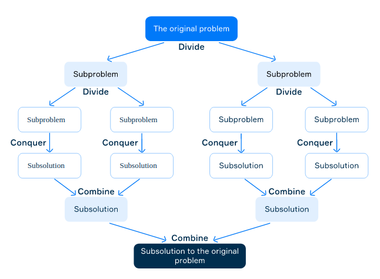

# Divide-Conquer Algorithms

A typical algorithm based on the divide and conquer paradigm consists of three steps:

1. **Divide:** split a problem into smaller sub-problems of the same type. Each sub-problem should represent a part
 of the original problem.
2. **Conquer:** recursively solve the sub-problems. If they are simple enough, solve them directly using base case
 conditions.
3. **Combine:** unite the solutions of the sub-problems to get the solution for the original problem.



```
calc_sum(array, left, right):
    # the sum of zero elements is 0
    if left == right:
        return 0    

    # the sum of one-element sub-array is the element
    if left == right-1:
        return array[left]

    # the index of the middle element to divide the array into two sub-arrays
    middle = (left + right) / 2

    # the sum of elements in the left subarray
    left_sum = calc_sum(array, left, middle)

    # the sum of elements in the right subarray
    right_sum = calc_sum(array, middle, right)

    # the sum of elements in the array
    return left_sum + right_sum
```