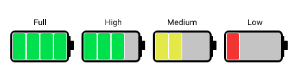

# Enum

Sometimes it is a good idea to use constants in your programs. These constants are often grouped based on their content: seasons, colors, states, etc. To store a bunch of constants in one place and handle them in Java you can use an enum.

## Basics

- All of these instances are created by JVM in the same way as a static field of a class. This is a reason why an enum cannot contain a public constructor.

```java
public enum Season {
    SPRING, SUMMER, AUTUMN, WINTER
}
```

### Sample enum

```java
public enum ChargeLevel {
    FULL, HIGH, MEDIUM, LOW
}

// initialize a variable of the type ChargeLevel
ChargeLevel high = ChargeLevel.HIGH;

System.out.println(high.name()); // HIGH

// access an enumeration instance by its name
ChargeLevel medium = ChargeLevel.valueOf("MEDIUM"); // MEDIUM

// look at all enumeration's constants
ChargeLevel[] levels = ChargeLevel.values(); // [FULL, HIGH, MEDIUM, LOW]

// ordinal position of instance among enums:
System.out.println(high.ordinal()); // 1
```

- Although an enum is a reference type, two variables can be correctly compared by using both the equals method and the operator ==

  ```java
  System.out.println(high.equals(ChargeLevel.HIGH)); // true
  System.out.println(high == ChargeLevel.HIGH); // true
  ```

## Fields and Methods



```java
public enum ChargeLevel {

    FULL(4, "green"),
    HIGH(3, "green"),
    MEDIUM(2, "yellow"),
    LOW(1, "red");

    int sections;
    String color;

    ChargeLevel(int sections, String color) {
        this.sections = sections;
        this.color = color;
    }

    public int getSections() {
        return sections;
    }

    public String getColor() {
        return color;
    }

		public static ChargeLevel findByColor(String color) {
        for (ChargeLevel value: values()) {
            if (color.equals(value.color)) {
                return value;
            }
        }
        return null;
    }
}
```

## Tips

- Enum is a container for a collection of constants.
- Enum has some embedded properties and methods for your convenience.
- Enum allows you to get the name and position of the constant, and make your life easier by enabling you to get all the instances of an enum or just one of them.

## Account example

```java
import java.util.Scanner;

public class Main {

    /**
     * The method change the balance of the given account according to an operation.
     * @param account
     * @param operation
     * @return true if the balance has changed, otherwise - false.
     */
    public static boolean changeBalance(Account account, Operation operation, Long sum) {
        // write your implementation here
        Long balance = operation == Operation.DEPOSIT ? account.getBalance() + sum : account.getBalance() - sum;
        if (balance < 0) {
            System.out.println("Not enough money to withdraw.");
            return false;
        }
        account.setBalance(balance);
        return true;
    }

    enum Operation {
        /**
         * deposit (add) an amount into an Account
         */
        DEPOSIT,
        /**
         * withdraw (subtract) an amount from an Account
         */
        WITHDRAW
    }

    static class Account {

        private String code;
        private Long balance;

        public String getCode() {
            return code;
        }

        public Long getBalance() {
            return balance;
        }

        public void setBalance(Long balance) {
            this.balance = balance;
        }
    }

    public static void main(String[] args) {
        Scanner scanner = new Scanner(System.in);

        String[] parts = scanner.nextLine().split("\\s+");

        Account account = new Account();
        account.setBalance(Long.parseLong(parts[0]));

        Operation operation = Operation.valueOf(parts[1]);

        Long sum = Long.parseLong(parts[2]);

        if (changeBalance(account, operation, sum)) {
            System.out.println(account.getBalance());
        }
    }
}
```
