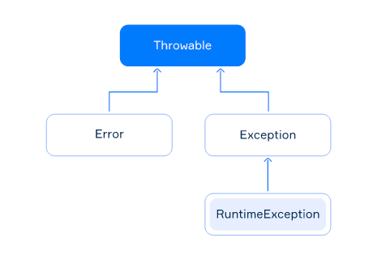

# Exceptions

## Hierarchy of exceptions

The base class for all exceptions is `java.lang.Throwable`. This class provides a set of common methods for all exceptions:

- `String getMessage()` returns the detailed string message of this exception object;
- `Throwable getCause()` returns the cause of this exception or `null` if the cause is nonexistent or unknown;
- `printStackTrace()` prints the stack trace on the standard error stream.



The `Throwable` class has two direct subclasses: `java.lang.Error` and `java.lang.Exception`.

- subclasses of the `Error` class represents low-level exceptions in JVM, for example: `OutOfMemoryError`, `StackOverflowError`;
- subclasses of the `Exception` class deal with exceptional events inside applications, such as: `RuntimeException`, `IOException`;
- the `RuntimeException` class is rather a special subclass of `Exception`. It represents so-called **unchecked** exceptions, including: `ArithmeticException`, `NumberFormatException`, `NullPointerException`

## Checked and unchecked exceptions

1. Checked exceptions are represented by the Exception class, excluding RuntimeException subclass. The compiler checks whether the programmer expects their occurrence in a program or not.

2. Unchecked exceptions are represented by the RuntimeException class and all its subclasses. The compiler does not check whether the programmer expects their occurrence in a program or not.

### More info

[here](https://docs.oracle.com/en/java/javase/11/docs/api/java.base/java/lang/Exception.html)

## try-catch statement

- Note that the specified type in a catch block must extend the Throwable class.

```java
ystem.out.println("before the try-catch block"); // it will be printed

try {
    System.out.println("inside the try block before an exception"); // it will be printed

    System.out.println(2 / 0); // it throws ArithmeticException

    System.out.println("inside the try block after the exception"); // it won't be printed
} catch (Exception e) {
    System.out.println("Division by zero!"); // it will be printed
}

System.out.println("after the try-catch block"); // it will be printed
```

When an exception occurs in the try block, the runtime system determines the first suitable catch block according to the type of the exception. Matching goes from top to down.

```java
try {
    // code that may throw exceptions
} catch (SQLException | IOException e) {
    // handling SQLException, IOException and their subclasses
    System.out.println(e.getMessage());
} catch (Exception e) {
    // handling any other exceptions
    System.out.println("Something goes wrong");
}
```

> Important, the catch block with the base class has to be written below all blocks with subclasses. In other words, the more specialized handlers (like IOException) must be written before the more general ones (like Exception). Otherwise, the code won't compile.

## The finally block

There is another possible block called finally. All statements present in this block will always execute regardless of whether an exception occurs in try block or not.

```java
try {
    // code that may throw an exception
} catch (Exception e) {
    // exception handler
} finally {
    // code always be executed
}
```
