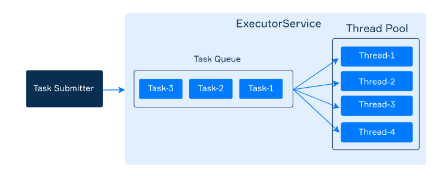

# Executors

- Simplify the development of multi-thread applications
- Java provides an abstraction called `ExecutorService` that encapsulate one or more threads into a single pool and puts submitted tasks in an internal queue to execute them by using the thread
- Isolates tasks from threads and allows you to focus on tasks.



### Creating executors

- Located in the `java.util.concurrent` package
- The package contains a convenient utility class `Executors` for creating different types of `ExecutorService`
- It can execute multiple tasks concurrently and speed up your program by performing somewhat parallel computations.

```java
ExecutorService executor = Executors.newFixedThreadPool(4);
```

### Submitting taks

- An executor has the `submit` method that accepts a `Runnable` task to be executed.

```java
executor.submit(() -> System.out.println("Hello!"));
```

- After invoking `submit`, the current thread does not wait for the task to complete. It just adds the task to the executor's internal queue to be executed asynchronously by one of the threads.

### Stopping executors

An executor continues to work after the completion of a task since threads in the pool are waiting for new coming tasks. Your program will never stop while at least one executor still works.

There are two methods for stopping executors:

- `void shutdown()` waits until all running task completes and prohibits submitting of new tasks;
- `List<Runnable> shutdownNow()` immediately stops all running tasks and returns a list of the tasks that were
 awaiting execution.

```java
ExecutorService executor = Executors.newFixedThreadPool(4);

// submitting tasks

executor.shutdown();

boolean terminated = executor.awaitTermination(60, TimeUnit.MILLISECONDS);

if (terminated) {
    System.out.println("The executor was successfully stopped");
} else {
    System.out.println("Timeout elapsed before termination");
}
```

## Example

```java
import java.util.concurrent.ExecutorService;
import java.util.concurrent.Executors;

public class ExecutorDemo {
    private final static int POOL_SIZE = 4;
    private final static int NUMBER_OF_TASKS = 10;
    
    public static void main(String[] args) {
        ExecutorService executor = Executors.newFixedThreadPool(POOL_SIZE);

        for (int i = 0; i < NUMBER_OF_TASKS; i++) {
            int taskNumber = i;
            executor.submit(() -> {
                String taskName = "task-" + taskNumber;
                String threadName = Thread.currentThread().getName();
                System.out.printf("%s executes %s\n", threadName, taskName);
            });
        }

        executor.shutdown();
    }
}

// pool-1-thread-1 executes task-0
// pool-1-thread-2 executes task-1
// pool-1-thread-4 executes task-3
// pool-1-thread-3 executes task-2
// pool-1-thread-3 executes task-7
// pool-1-thread-3 executes task-8
// pool-1-thread-3 executes task-9
// pool-1-thread-1 executes task-6
// pool-1-thread-4 executes task-5
// pool-1-thread-2 executes task-4
```

In case we don't know how many threads are needed in our pool, we can take the number of available processors as the pool size.

```java
int poolSize = Runtime.getRuntime().availableProcessors();
ExecutorService executor = Executors.newFixedThreadPool(poolSize);
```

## Types of executors

1. An executor with a single thread

    ```java
    ExecutorService executor = Executors.newSingleThreadExecutor();
    ```

2. An executor with the growing pool

    ```java
    ExecutorService executor = Executors.newCachedThreadPool();
    ```

3. An executor that schedules a task

    ```java
    ScheduledExecutorService executor = Executors.newSingleThreadScheduledExecutor();

    executor.scheduleAtFixedRate(() -> 
            System.out.println(LocalTime.now() + ": Hello!"), 1000, 1000, TimeUnit.MILLISECONDS);

    // 02:30:06.375392: Hello!
    // 02:30:07.375356: Hello!
    // 02:30:08.375376: Hello!
    ```