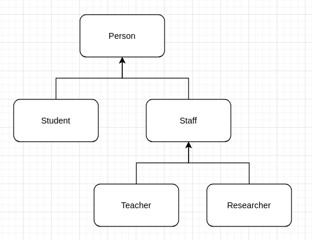

# Inheritance

Inheritance is a mechanism for deriving a new class from another class (base class). The new class acquires some fields and methods of the base class.

> Inheritance represents the IS-A relationship.

## Extending classes

A class **derived** from another class is called a **subclass** (it's also known as a **derived class**, **extended** **class** or **child** **class**). The class from which the subclass is derived is called a **superclass** (also a **base** **class** or a **parent** **class**).

```java
class SuperClass { }

class SubClassA extends SuperClass { }
```

### Obs

- Java doesn't support multiple-classes inheritance meaning that a class can only inherit from a single superclass;
- a class hierarchy can have multiple levels (class `C` can extend class `B` that extends class `A`);
- a superclass can have more than one subclasses.
- A subclass inherits all public and protected fields and methods from the superclass. A subclass can also add new fields and methods. The inherited and added members will be used in the same way.
- A subclass doesn't inherit private fields and methods from the superclass. However, if the superclass has public or protected methods for accessing its private fields, these members can be used inside the subclasses.

## Class hierarchy

The class hierarchy for the College:

- the base class `Person` has fields for storing common data: name, year of birth, and address;
- the class `Student` has additional fields to store course and status (boolean graduated);
- the class `Staff` stores the start date of work for the college and the salary;
- the class `Teacher` has an array of the classes that a Teacher can teach;
- the class `Researcher` may have have awards.



```java
class Person {
    protected String name;
    protected int yearOfBirth;
    protected String address;

    // public getters and setters for all fields here
}

class Student extends Person {
    protected String course;
    protected boolean graduated;

    // public getters and setters for all fields here
}

class Staff extends Person {
    protected Date startDate;
    protected Long salary;

    // public getters and setters for all fields here
}

class Teacher extends Staff {
    protected String[] classes;

    public String[] getClasses() {
        return classes;
    }

    public void setClasses(String[] classes) {
        this.classes = classes;
    }
}

class Researcher extends Staff {
    protected boolean awards;

    public boolean isAwards() {
        return awards;
    }

    public void setAwards(boolean awards) {
        this.awards = awards;
    }
}
```

## Final classes

If you'll try to extend the class, the compile-time error will happen.

```java
final class SuperClass { }
```
