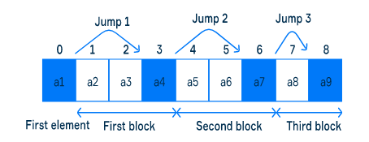
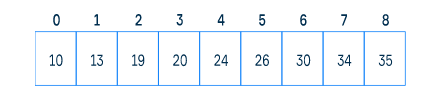
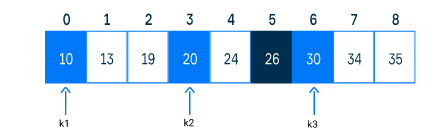
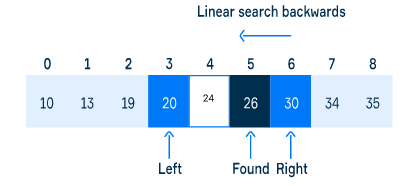

# Jump Search

- Find a position of an element in a **sorted array**
- Split the given array into blocks that may contain the target element
- The optimal block size is sqrt(n) where **n** is the array length
- Space complexity O(1) → does not require other data structure for its implementation

### Principles

- If the array is ascending, an element of a block is less than or equal to a value of the following block.
- If a value is not present in the first block from the beginning whose right border exceeds the - value, it is not present in the array at all.
- The algorithm jumps over blocks to find one that may contain the target element. To do that, the algorithm compares the right borders of blocks to this target element.

### Searching

- If sqrt(n) is not an integer value, we take only the integer part;
- If the index of the following element to jump to is greater than the last element index, we jump to the last element.

### Example

Suppose we have a sorted ascending array. We want to find the value 26 using jump search.

The optimal jump length is 3. Notice that during the algorithm, we stores indexes of the current and the previously considered element to use them.

1. The first element (10) is less the target value (26), so jump to the next element with the index 3. 
2. The element 20 is less than 26, so jump to the next element with index 6
3. The element 30 is greater than 26.
4. Do a backward linear search

### Tradeoff

- It is faster than the linear search technique which has a time complexity of O(n) for searching an element
- It is slower than binary search algorithm which searches an element in O(log n)
- It requires the input array to be sorted

### Implementation

We could implement jump search with a recursion instead of backward linear search. Check implementation bellow.

- [jumpSearch](https://gist.github.com/LeoPFreitas/47a6526c8e2b4bd64702d50109d57b48)
- [recursiveJumpSearch](https://gist.github.com/LeoPFreitas/6a197d118da9a05daf1eed8f5e7e8856)