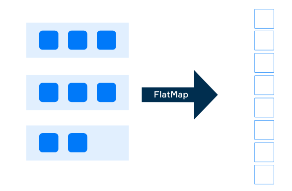

# Map and flatMap

## Map

The `map` is the method of a `Stream` class that takes a one-argument function as a parameter. The main purpose of the map operation is to apply that function to each element of the stream and return a resulting stream that has the same amount of elements.

```java
List<Double> numbers = List.of(6.28, 5.42, 84.0, 26.0);

List<Double> famousNumbers = numbers.stream()
        .map(number -> number / 2) // divide each number in the stream by 2
        .collect(Collectors.toList()); // collect transformed numbers to a new list
```

```java
class User {
    private long id;
    private String firstName;
    private String lastName;
}

class Account {
    private long id;
    private boolean isLocked;
    private User owner;
}

class AccountInfo {
    private long id;
    private String ownerFullName;
}

List<AccountInfo> infoList = accounts.stream()
        .map(acc -> {
                AccountInfo info = new AccountInfo();
                info.setId(acc.getId());
                String ownerFirstName = acc.getOwner().getFirstName();
                String ownerLastName = acc.getOwner().getLastName();
                info.setOwnerFullName(ownerFirstName + " " + ownerLastName);
                return info;
        }).collect(Collectors.toList());
```

### Primitive-specialized types of the map operation

- We can map `int` elements of the `IntStream` to the stream of objects using `mapToObj` method and collect the resulting stream

```java
class Planet {
    private String name;
    private int orderFromSun;

    public Planet(int orderFromSun) {
        this.orderFromSun = orderFromSun;
    }
}

List<Planet> planets = IntStream.of(1, 2, 3, 4, 5, 6, 7, 8)
        .mapToObj(Planet::new)
        .collect(Collectors.toList());
```

## The flatMap operation

- Flattening refers to merging elements of a list of lists to a single list. For example, if we flatten a `[["a", "b"], ["c"], ["d", "e"]]` list of lists, we will get `["a", "b", "c", "d", "e"]` list.



```java
List<Book> javaBooks = List.of(
        new Book("Java EE 7 Essentials", 2013, List.of("Arun Gupta")),
        new Book("Algorithms", 2011, List.of("Robert Sedgewick", "Kevin Wayne")),
        new Book("Clean code", 2014, List.of("Robert Martin"))
);

List<String> authors = javaBooks.stream()
        .flatMap(book -> book.getAuthors().stream())
        .collect(Collectors.toList());

// ["Arun Gupta", "Robert Sedgewick", "Kevin Wayne", "Robert Martin"]
```