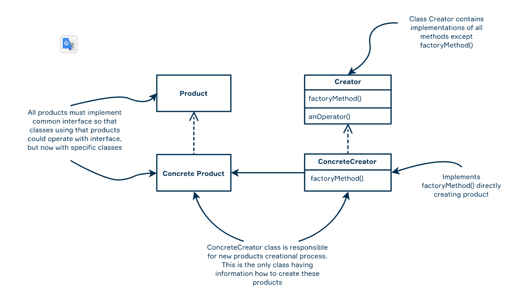
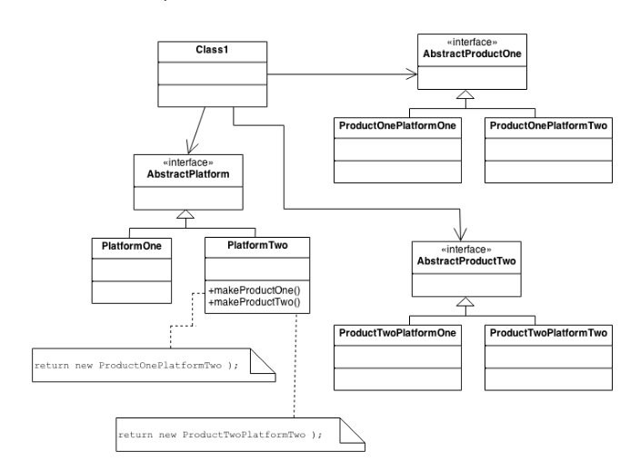

# Objects and Factory

**Factory** 

- is a way of creating objects when one part of a program (a class or a method) creates objects and another one processes them.
- Encapsulate the code for creating objects of a hierarchy in a special place (factory).

There are several kinds of factories: **static factory**, **simple factory**, **factory method** and **abstract factory**.

```java
class Computer {
    
    private long ram;
    private long cpu;
    
    // getters and setters
}
 
class PC extends Computer { 
    
    // additional members
}
 
class Laptop extends Computer { 
    
    // additional members
}
```

## Static factory

- The simplest factory
- It has one static method which creates objects of the hierarchy
- The method takes a required type as a string or enum argument and returns a corresponding subclass instance through the base class.

```java
class ComputerStaticFactory {
    
    public static Computer newInstance(String type) {
        if (type.equals("Computer")) {
            return new Computer();
        } else if (type.equals("PC")) {
            return new PC();
        } else if (type.equals("Laptop")) {
            return new Laptop();
        }
        return null; // if not a suitable type
    }
}

public class FactoryClient {
    
    public static void main(String args[]) {
        
        Computer pc = ComputerStaticFactory.newInstance("PC");
        System.out.println(pc instanceof PC); // prints "true"
       
        Computer laptop = ComputerStaticFactory.newInstance("Laptop");
        System.out.println(laptop instanceof Laptop); // prints "true"
    }
}
```

There are several possible implementation features:

- the method `newInstance` of `ComputerStaticFactory` takes an enum type to restrict possible values;
- the method `newInstance` throws an exception if an unsuitable type is passed instead of returning `null`;
- move the method `newInstance` directly to the base of the hierarchy: `Computer` class;
- a factory can have multiple methods that produce instances of different classes or an instance of a default class.

## Simple factory

- The simple factory idiom has the same features as the static factory
- It is possible to create multiple differently parameterized factories to control instantiating.
- Can also subclass the factory and override its non-static method that is used to create other factories.
- 

```java
class ComputerFactory {
    
    // it may contain some fields
    
    public Computer newInstance(String type) {
        if (type.equals("Computer")) {
            return new Computer();
        } else if (type.equals("PC")) {
            return new PC();
        } else if (type.equals("Laptop")) {
            return new Laptop();
        }
        return null;
    }
}

ComputerFactory factory = new ComputerFactory();
Computer pc = factory.newInstance("PC");
```

## Factory method

- Defines an interface for creating an object but leaves it to the subclasses to decide which class to instantiate.
- Allows the class to delegate instantiation to subclasses.
- Protect customers from the details of creating copies of classes or class hierarchy

### Components

- Creator;
- Concrete Creator;
- Product;
- Concrete Product.



1. **Creator** declares an abstract or virtual method of creating a product. It uses the factory method in its
 implementation. Samples: Hero Factory, Music Factory, Furniture Factory, DB Factory.
2. **ConcreteCreator** implements a factory method that returns ConcreteProduct. Samples: Rock Music Factory, Door
 Furniture Factory, MongoDB Factory.
3. **Product** defines the interface of products created by the factory method. Samples: Robot, Detail, Transport
, Hero, File, Furniture.
4. **ConcreteProduct** determines the specific type of products. Samples: RobotCleaner, ElfHero, MP3File, Detail13.

### Example

```java
abstract class Table {
    private String name;
 
    Table(String name) {
        this.name = name;
    }
 
    String getName() {
        return name;
    }
 
    void attachLegs() {
        System.out.println("Attaching Legs");
    }
 
    void attachTableTop() {
        System.out.println("Attaching tabletop");
    }
}

class TableOffice extends Table {
    TableOffice(String name) {
        super(name);
    }
}
 
class TableKitchen extends Table {
    TableKitchen(String name) {
        super(name);
    }
}

abstract class TableFactory {
 
    abstract Table createTable(String type);
 
    Table orderTable(String type) throws InterruptedException {
        Table table = createTable(type);
        if (table == null) {
            System.out.println("Sorry, we are not able to create this kind of table\n");
            return null;
        }
        System.out.println("Making " + table.getName());
        table.attachLegs();
        table.attachTableTop();
        Thread.sleep(1500L);
        System.out.println("Created " + table.getName() + "\n");
        return table;
    }
}
 
class TableStore extends TableFactory {
    @Override
    Table createTable(String type) {
        if (type.equals("office")) {
            return new TableOffice("Office Table");
        } else if (type.equals("kitchen")) {
            return new TableKitchen("Kitchen Table");
        } else return null;
    }
}

class TestDrive {
    public static void main(String[] args) throws InterruptedException {
        TableStore tableStore = new TableStore();
 
        Table strangeTable = tableStore.orderTable("Mysterious table");
 
        Table officeTable = tableStore.orderTable("office");
        Table kitchenTable = tableStore.orderTable("kitchen");
 
    }
}
```

## Abstract factory

- Abstract Factory is one of the creational patterns.
- It encapsulates the creational process of related or dependent objects.
- There is no node to specify the concrete classes of these objects



```java
interface Table {
    public String getTable();
}

public class KitchenTable implements Table {
    @Override
    public String getTable() {
        return "There is a kitchen table";
    }
}

public class OfficeTable implements Table {
    @Override
    public String getTable() {
        return  "There is an office table";
    }
}

interface TableInstruments {
    public String getInstrument();
}

public class KitchenTableInstrument implements TableInstruments {
    @Override
    public String getInstrument() {
        return "These are a kitchen table instruments";
    }
}

public class OfficeTableInstrument implements TableInstruments {
    @Override
    public String getInstrument() {
        return "These are an office table instruments";
    }
}

// abstract factory
interface TableFactory {
    public Table makeTable();
    public TableInstruments makeTableInstruments();
}

public class KitchenTableFactory implements TableFactory {
    @Override
    public Table makeTable() {
        return new KitchenTable();
    }

    @Override
    public TableInstruments makeTableInstruments() {
        return new KitchenTableInstrument();
    }
}

public class OfficeTableFactory implements TableFactory {
    @Override
    public Table makeTable() {
        return new OfficeTable();
    }

    @Override
    public TableInstruments makeTableInstruments() {
        return new OfficeTableInstrument();
    }
}

Table table;
TableInstruments tableInstruments;

TableFactory kitchenTableFactory = new KitchenTableFactory();
TableFactory officeTableFactory = new OfficeTableFactory();

System.out.println("-I work as a cook. I need a kitchen table");
System.out.println("-Got It! Give me a sec,- Calling to the KitchenTableFactory. - Bring me the KitchenTable with KitchenTableInstruments");
Thread.sleep(5000);
        
table = kitchenTableFactory.makeTable();
tableInstruments = kitchenTableFactory.makeTableInstruments();

System.out.println(table.getTable() + "\n" + tableInstruments.getInstrument());
System.out.println("-There they are!\n");
Thread.sleep(5000);

System.out.println("-I am office manager. I need an office table");
System.out.println("-Got It! Give me a sec,- Calling to the OfficeTableFactory. - Bring me the OfficeTable with OfficeTableInstruments");
Thread.sleep(5000);
        
table = officeTableFactory.makeTable();
tableInstruments = officeTableFactory.makeTableInstruments();

System.out.println(table.getTable() + "\n" + tableInstruments.getInstrument());
System.out.println("-There they are!");

// -I work as a cook. I need a kitchen table
// -Got It! Give me a sec,- Calling to the KitchenTableFactory. - Bring me the KitchenTable with KitchenTableInstruments
// There is a kitchen table
// These are a kitchen table instruments
// -There they are!

// -I am office manager. I need an office table
// -Got It! Give me a sec,- Calling to the OfficeTableFactory. - Bring me the OfficeTable with OfficeTableInstruments
// There is an office table
// These are an office table instruments
// -There they are!
```