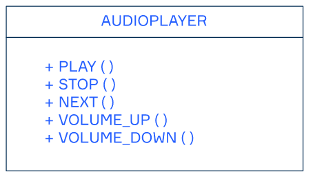
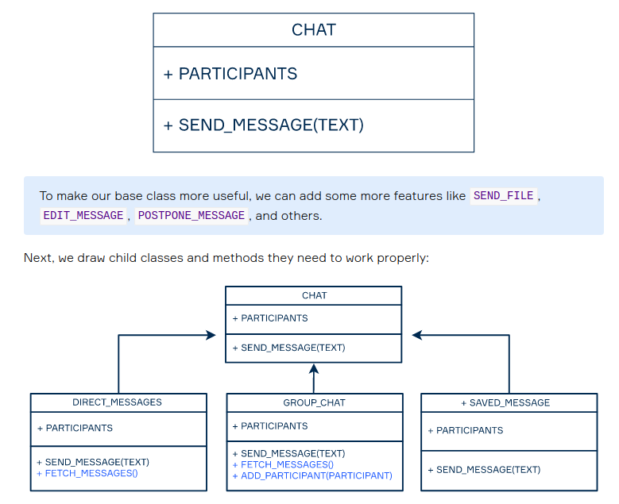
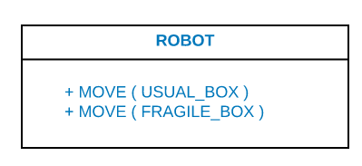

# OOP

## Fundamentals

Object-Oriented programming (OOP) is a programming paradigm based on the concept of objects that interact with each other to perform the program functions. Each object can be characterized by a **state** and **behavior.** An object keeps the current state in the **fields** and the behavior in the **methods**

### OOP basic principles

There are four basic principles of OOP. They are **encapsulation, abstraction, inheritance,** and **polymorphism.**

- **Data encapsulation** is the mechanism of hiding the internal data of objects from the world. All interaction with the object and its data are performed through its public methods. Encapsulation allows programmers to protect the object from inconsistency.
- **Data abstraction** means that objects should provide the simplified, abstract version of their implementations. The details of their internal work usually aren't necessary for the user, so there's no need to represent them. Abstraction also means that only the most relevant features of the object will be presented.
- **Inheritance** is a mechanism for defining parent-child relationships between classes. Often objects are very similar, so inheritance allows programmers to reuse common logic and at the same time introduce unique concepts into the classes.
- **Polymorphism** literally means *one name and many forms,* and it concerns the inheritance of the classes. Just as the name suggests, it allows programmers to define different logic of the same method. So, the name (or interface) stays the same, but the actions performed may be different. In practice, it is done with overloading or overriding.

### Objects and Classes

Object

- Programs are made from different objects interacting with each other.
- Attributes characterize objects' data or states
- Methods characterize objects' behavior.

Classes

- Often, many individual objects have similar characteristics. We can say these objects belong to the same type or class
- Describes a common structure of similar objects: their fields and methods.
- An object is an individual instance of a class.

### Tips

- an object-oriented program consists of a set of interacting objects;
- as a rule, the internal state of an object is hidden;
- an object may have characteristics: fields and methods;
- an object is an instance of a class (type);
- a class is a more abstract concept than an individual object; it may be considered a template or blueprint that describes the common structure of a set of similar objects.

## Encapsulation

Encapsulation refers to bundling data with the methods operating with it while restricting direct access to some components.

### Getters and setters

- Methods to get and set data
- With the SET method, we can check if the new data are correct and it doesn't break the integrity of an object.

## Interfaces

- An interface is a collection of methods that describes the behavior of an object.
- To implement the interface, an object should implement all the methods from it.

### One-method interface

When you're at home, you may prefer to listen to music with loudspeakers, but in public, you hopefully use headphones. We can say that loudspeakers and headphones implement the interface with a method MAKE_SOUND.

> use verbs for method names, and nouns or adjectives are for interface names.

### Responsibility of an interface

If you don't break up interfaces with many responsibilities into smaller ones, the code will become tangled, and neither you, nor other developers will understand it.

We want our objects to communicate through simple interfaces even when they have a lot of methods. All of these methods should be necessary to do the job right.

## Inheritance

With the help of inheritance, we can instead reuse the code we already have.

> Inheritance is a relation between entities that we interpret as "is a" or "is a kind of" relation. In the case of programming methods and attributes, it means that a child entity has every feature of the parent entity

## Polymorphism

- Polymorphism is the ability of an object or its methods to take on many forms depending on its type and the parameters of this or that method.
- The mechanism of defining several methods with the same name but with different parameters is known as overloading.

Assume you're programming robots that move boxes in a smart warehouse. For now, we only have two types of boxes: USUAL_BOX and FRAGILE_BOX but it doesn't mean that there won't be other different types of boxes in the future. To make working with robots easier, we create only one method MOVE:

### Subtyping

Robots can reach a certain height, but we cannot expect them to reach the highest shelves. For this kind of task we can create the DRONE subclass of robots. Basically, these drones do the same thing as the robots that run on the ground: they MOVE all kinds of boxes.

We can say that our robots take various forms, so we have a polymorphic object that may be a usual robot, or a drone, and how they perform the task depends on their type.

- The technique to redefine methods of the parent class in its subclasses is called overriding.
