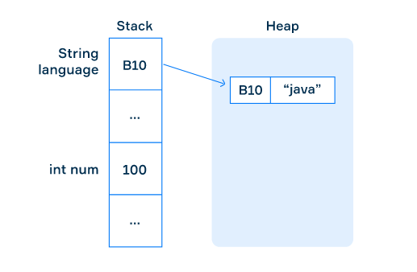
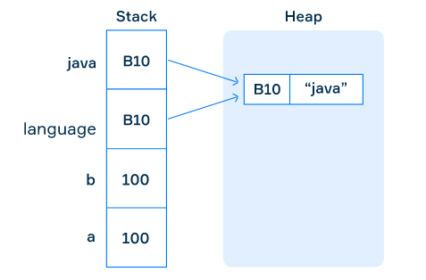

# Primitive type x Reference type

## Introduction

In Java, all data types are separated into two groups: primitives and references types

**Primitive data types →** includes byte, short, int, long, float, double, boolean and char

**Non-primitive data types** → such as String, Arrays and Classes (you will learn more about these in a later chapter)

### New keyword

Generally, an object of a reference type can be created using the **new** keyword. This allocates memory for the object we create. That is instantiation of the object (we create an instance of it). Then we initialize the variable by assigning some value to it.

```java
String language = new String("java");
```

## Main difference

The basic difference is that a variable of a primitive type stores the actual values, whereas a variable of a reference type stores an address in memory (reference) where the data is located. The data can be presented as a complex structure that includes other data types as their parts.

The following picture simply demonstrates this difference. There are two main memory spaces: stack and heap. All values of primitive types are stored in stack memory, but variables of reference types store addresses on objects located in heap memory.



## Assignment

- Primitives types → the value is just copied
- Reference types → the address to the value is copied

```java
int a = 100;
int b = a; // 100 is copied to b

String language = new String("java");
String java = language;
```



## Comparisons

Comparing references types is different then comparing primitives types. When you compare two variables of the String type, it compares references (address).

```java
String s1 = new String("java");

String s2 = new String("java");
String s3 = s2;

System.out.println(s1 == s2); // false
System.out.println(s2 == s3); // true
```

The correct way to compare content is to invoke the special method equals.

```java
String s1 = new String("java");
String s2 = new String("java");
String s3 = s2;

System.out.println(s1.equals(s2)); // true
System.out.println(s2.equals(s3)); // true
```

## Type null

Unlike primitive types, a variable of a reference type can refer to a special null value that represents the fact that it is not initialized yet or doesn't have a value.
