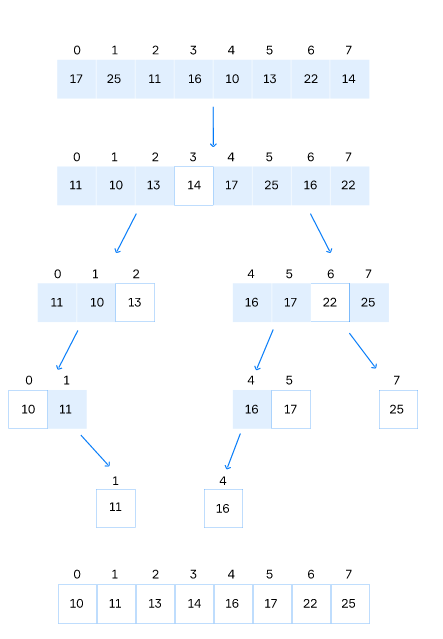

# Quick Sort

- Efficient in-place sorting algorithm that is often faster in practice compared to other sorting algorithms.
- Based on the divide-and-conquer paradigm.
- The time complexity is O(nlog(n)) in the average case, and O(n^2) in the worst case.

Steps of quicksort:

1. Pick some element from the array. We will call that element a**pivot**.
2. Reorder the array so that all values smaller than the pivot are positioned before it and all larger values come after; values equal to the pivot can go either way.
3. Recursively sort the subarrays of smaller and greater elements.

### Choosing a Pivot

- Strongly affects the sorting time.
- The best pivot would divide the array into two equal parts, which would halfe the problem size.

Here are some possible methods of choosing the pivot:

- Pick the leftmost or the rightmost element;
- Pick the middle element;
- Pick a random element;
- Take the first, middle and last value of the array and choose the median of these three numbers as the pivot.

## Pseudocode

1) Let's pick the rightmost element14as the pivot in the original array and then reorder it so that all values smaller than the pivot –`11, 10, 13`– come before it and all values larger than the pivot –`17, 25, 16, 22`– follow it. After the rearrangement, the pivot has the index33.

2) Divide the array into two subarrays: the left one`{ 11, 10, 13 }`and the right one`{ 17, 25, 16, 22 }`. The pivot is excluded from both subarrays.

3) Consider the left subarray. The pivot is13. After rearranging, we obtain the same order of elements in the array`{ 11, 10, 13 }`.

4) Divide the subarray`{ 11, 10, 13 }`into two smaller subarrays: the left one`{ 11, 10 }`and the empty subarray.

5) Consider the sub array`{ 11, 10 }`. The pivot is10. After rearranging, we obtain the order`{ 10, 11 }`.

6) Divide the subarray`{ 10, 11 }`into two smaller subarrays: the empty array and`{ 11 }`. Both new arrays are already sorted. The pivot10is excluded.

Note, we consider empty and single-element arrays as already sorted and do not process them.

7) We go through the same steps for the right subarray`{ 17, 25, 16, 22 }`of the original array until all subarrays are empty or consist of a single element.

After, the whole array is sorted:`{ 10, 11, 13, 14, 16, 17, 22, 25 }`.

### Problems

1. Unfortunately, the Lomuto partition scheme causes worst-case behavior **O(n^2)** in already sorted arrays.
2. When all the input elements are equal, one subarray is always empty while another has only decreased by one element (the pivot is removed). This causes the worst-case behavior.