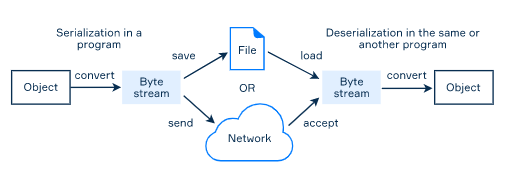

# Serialization basic

- The lifetime of all objects within a program is limited by the runtime. We can save objects to some permanent storage like a had drive and read them back the next time the program starts.

### Serialization and deserialization

- The are 2 processes to save and restore the state of objects between program launches: **serialization** and **deserialization**
- S**erialization** → converts the state of an object into a stream of bytes.
- **Deserialization →** The serialized object is used to reconstruct the actual object



### Serializable class

- It must implement the `serializable` interface.
- To prevent a field from being serialized user the keyword `transient`
- There is a recommendation to add a special field called `serialVersionUID` for every class that implements this interface. The field should be `static`, `final` and of the `long` type → used to verify that the sender and receiver of a serialized object are compatible and have loaded the classes for that object (`InvalidClassException` in case they don't match)

```java
class SomeClass implements Serializable {

	private transient String nonSerialziedField;
	private static final long serialVersionUID = 7L;    

	// fields and methods		
}
```

## Streams for objects

- Serialization and deserialization mechanisms are based on the standard I/O system and byte streams → use `ObjectOutputStream` and `ObjectInputStream`
- `ObjectOutputStream` → provides a method called `void writeObject(Object objecct)` which writes the state of the specified object to the stream
- `ObjectInputStream` → has a corresponding method `Object readObject()` to restore the object
- Both methods throw exceptions when something is wrong.

Code example

- `FileOutputStream` and `FileInputStream` are used for working with a file;
- `BufferedInputStream` and `BufferedOutputStream` are optional but useful for speeding up the I/O operations;
- `ObjectOutputStream` and `ObjectInputStream` perform serialization and deserialization of objects and also invoke
 wrapped streams to work with the file;
- both methods also close the streams to avoid resource leaks.

```java
class SerializationUtils {
    /**
     * Serialize the given object to the file
     */
    public static void serialize(Object obj, String fileName) throws IOException {
        FileOutputStream fos = new FileOutputStream(fileName);
        BufferedOutputStream bos = new BufferedOutputStream(fos);
        ObjectOutputStream oos = new ObjectOutputStream(bos);
        oos.writeObject(obj);
        oos.close();
    }

    /**
     * Deserialize to an object from the file
     */
    public static Object deserialize(String fileName) throws IOException, ClassNotFoundException {
        FileInputStream fis = new FileInputStream(fileName);
        BufferedInputStream bis = new BufferedInputStream(fis);
        ObjectInputStream ois = new ObjectInputStream(bis);
        Object obj = ois.readObject();
        ois.close();
        return obj;
    }
}
```

## Example

The value of `serialVersionUID` of a class should be increased whenever you make a change that adds/updates/removes a field. Otherwise, you may encounter exceptions during the deserialization process for objects which were saved before this change.

```java
public class Citizen implements Serializable {
    private static final long serialVersionUID = 1L;

    private String name;
    private Address address;
    private transient String passport;

    // getters and setters

    @Override
    public String toString() {
        return "Citizen{" +
                "name='" + name + '\'' +
                ", passport='" + passport + '\'' +
                ", address=" + address +
                '}';
    }
}

class Address implements Serializable {
    private static final long serialVersionUID = 1L;

    private String state;
    private String city;
    private String street;

    // getters and setters

    @Override
    public String toString() {
        return "Address{" +
                "state='" + state + '\'' +
                ", city='" + city + '\'' +
                ", street='" + street + '\'' +
                '}';
    }
}
```

- Generates an array of citizens

```java
public static Citizen[] initCitizens() {
    Citizen mark = new Citizen();
    mark.setName("Mark Olson");
    mark.setPassport("503143798"); // the passport was set

    Address markAddress = new Address();
    markAddress.setState("Arkansas");
    markAddress.setCity("Conway");
    markAddress.setStreet("1661  Dawson Drive");

    mark.setAddress(markAddress);

    Citizen anna = new Citizen();
    anna.setName("Anna Flores");
    anna.setPassport("605143321"); // the passport was set

    Address annaAddress = new Address();
    annaAddress.setState("Georgia");
    annaAddress.setCity("Atlanta");
    annaAddress.setStreet("4353  Flint Street");

    anna.setAddress(annaAddress);

    return new Citizen[]{ mark, anna };
}

public static void main(String[] args) {
    String filename = "citizens.data";
    try {
        SerializationUtils.serialize(initCitizens(), filename);
        Citizen[] citizens = (Citizen[]) SerializationUtils.deserialize(filename);
        System.out.println(Arrays.toString(citizens));
    } catch (IOException | ClassNotFoundException e) {
        e.printStackTrace();
    }
}

[Citizen{name='Mark Olson', passport='null', address=Address{state='Arkansas', city='Conway', street='1661  Dawson Drive'}}, 
Citizen{name='Anna Flores', passport='null', address=Address{state='Georgia', city='Atlanta', street='4353  Flint Street'}}]
```

### Conclusion

Here are a few points to remember:

- a class to be serialized must implement the `Serializable` interface;
- it is a good practice to add the `serialVersionUID` field to be consistent with the versions during deserialization;
- you must specify in which place to save the state of objects using I/O streams;
- use `writeObject` and `readObject` methods to serialize and deserialize any objects;
- do not forget to handle exceptions in real-world applications.