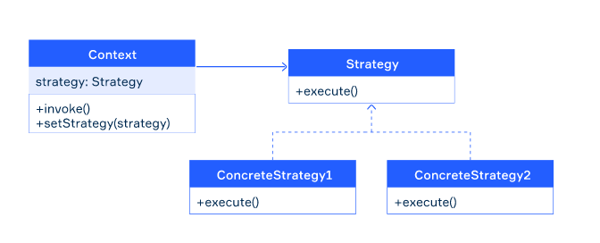

# Strategy

- One of the most used patterns in OO design
- Defines a family of algorithms, encapsulate each in separated class and makes them interchangeable within that family
- Useful when we have multiple algorithms for performing a task and we want to choose any of the algorithms at runtime.
- This pattern is especially good when the number of algorithms increases because it isolates algorithms from the client code.

## Introduction

In **Strategy** pattern, algorithms executed in different branches are moved into their own classes called strategies, all of which implement a common interface. Strategies represent behavior, not domain entities.

**Advantages:**

- it allows you to choose an algorithm (behavior) at runtime;
- it isolates the code of algorithms from the other classes, thus simplifying the addition of new algorithms;
- it lets the algorithm vary independently of clients that use it.

### To use the pattern:

1. Determine the common `Strategy` interface for a family of algorithms. It should contain one or more abstract methods.
2. Extract all algorithms into their own classes (concrete strategies). They should follow the `Strategy` interface.
3. Declare a special class called `Context` for storing a reference to a strategy. The context delegates execution to an instance of a concrete strategy through its interface, instead of implementing the behavior itself.



### Client code

1. Create an instance of `Context`
2. Set a strategy and invoke a special method to start the execution — the invocation will be delegated to a concrete strategy that is referred by the `strategy` field.

## Example

**Situation:** The application needs to send messages to the customers (SMS, e-mail, and others in the future).It would be nice to change the existing code as little as possible when adding new strategies.

### Implementation

Define a family of algorithms (sending methods). Each algorithm must encapsulate a logic to send a message using a concrete transport (SMS/e-mail).

```java
interface SendingMethod {
 
    void send(String from, String to, String msg);
}
 
class SmsSendingMethod implements SendingMethod {
 
    @Override
    public void send(String from, String to, String msg) {
        System.out.println(String.format("send SMS from '%s' to '%s'", from, to));
    }
}
 
class EmailSendingMethod implements SendingMethod {
 
    @Override
    public void send(String from, String to, String msg) {
        System.out.println(String.format("Email from '%s' to '%s'", from, to));
    }
}
```

`Context` that references a sending method and allows us to change the currently used method

```java
class MessageSender {
 
    private SendingMethod method;
    
    // it may contain additional fields as well
 
    public void setMethod(SendingMethod method) {
        this.method = method;
    }
 
    public void send(String from, String to, String msg) {
        this.method.send(from, to, msg);
    }
}
```

In the client code, we should create an instance of `MessageSender`, set a sending method and invoke the method send with three string arguments. Also, we can change the sending method to another one.

```java
MessageSender sender = new MessageSender(); // create a message sender
 
sender.setMethod(new EmailSendingMethod()); // set a concrete sending method
 
sender.send("alice@gmail.com", "bob@gmail.com", "Hello!");
 
sender.setMethod(new SmsSendingMethod()); // set another sending method
 
sender.send("1-541-444-3333", "1-541-555-2222", "Hello!");
```

## Complicating

### Field and constructors

- A concrete strategy may need its own settings stored in fields.

```java
class PushSendingMethod implements SendingMethod {
    
    private final boolean magicFlag;
    
    public PushSendingMethod(boolean magicFlag) {
        this.magicFlag = magicFlag;
    }
 
    @Override
    public void send(String from, String to, String msg) {
        System.out.println(String.format("Send push from '%s' to '%s'", from, to));
    }
}
```

- Set value when create an instance

```java
sender.setMethod(new PushSendingMethod(true));
```

### Different and unused arguments

- Different strategies may need different arguments or use not all arguments defined in the overridden method.
- New strategies may need other arguments which will require a change in the entire hierarchy.

```java
interface SendingMethod {
 
    void send(Message message);
}
 
class Message {
 
    public String from;
    public String to;
    public String title;
    public String text;
    public byte[] attachment; // attachment data just like an image or something else
}
```