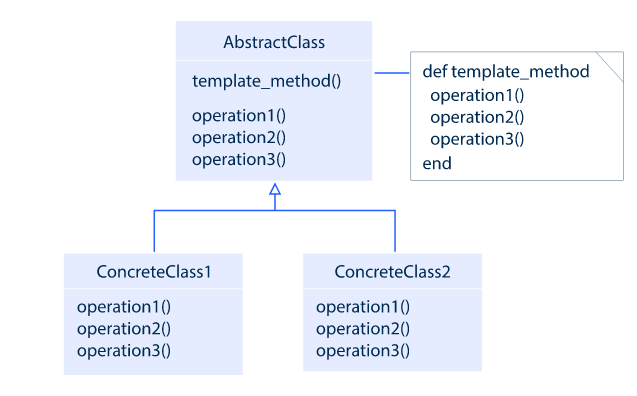

- Template Method is a behavioral pattern that describes the common algorithm while subclasses implement steps of this algorithm.
- This pattern lets the subclasses implement the steps of the algorithm without changing that algorithm's skeleton.

As an example, consider the working process. The algorithm contains three steps: got to work, work, go home. Suppose all workers go to work and go home in an absolutely identical manner. The working routine, however, is different and depends on the worker’s qualification. We can choose any profession, but the algorithm remains the same.

## Where to use

**Template Method** is applicable in the following cases:

- When the behavior of an algorithm can vary, you let subclasses implement the behavior through overriding;
- When you want to avoid code duplication, implementing variations of the algorithm in subclasses;
- When you want to be sure that subclassing is allowed.

## The pattern

An abstract base class implements standard algorithm steps and can provide a default implementation for custom steps. Specific subclasses provide concrete implementation for each of these steps.

Template Method has the following components:

- **Abstract Class** describes primitive operations and the template method itself which calls primitive operations;
- **Concrete Class** implements the primitive operations.



## Code example

```java
public abstract class Worker {
 
    public void work() {
        goToWork();
 
        workingProcess();
 
        goHome();
    }
 
    public void goToWork() {
        System.out.println("= I'm going to work sadly =");
    }
 
    public void goHome() {
        System.out.println("= I'm going home happy =");
    }
 
    public abstract void workingProcess();
}

public class Programmer extends Worker {
    public void workingProcess() {
        System.out.println(" > I'm a programmer");
        System.out.println(" > I drink coffee");
        System.out.println(" > I write code");
        System.out.println(" > I drink coffee again");
        System.out.println(" > I write code again");
    }
}
 
public class Actor extends Worker {
    public void workingProcess() {
        System.out.println(" > I'm an actor");
        System.out.println(" > I read a scenario");
        System.out.println(" > I get used to role ");
        System.out.println(" > I play a role");
   }
}

public class TemplateMethodDemo {
    public static void main(String[] args) {
        Worker programmer = new Programmer();
        Worker actor = new Actor();
        programmer.work();
        actor.work();
    }
}
```