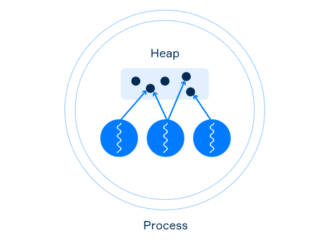

# Threads and shared data

- Threads that belong to the same process share the common memory (**Heap**).
- They may communicate by using shared data in memory → each thread must have a reference to this data



When you write your code in different threads that work with the same data concurrently, it is important to understand a few things:

- some operations are non-atomic;
- changes of a variable performed by one thread may be invisible to the other threads;
- if changes are visible, their order might not be (reordering).

```java
class Counter {

    private int value = 0;

    public void increment() {
        value++;
    }

    public int getValue() {
        return value;
    }
}

class MyThread extends Thread {

    private final Counter counter;

    public MyThread(Counter counter) {
        this.counter = counter;
    }

    @Override
    public void run() {
        counter.increment();
    }
}
```

```java
Counter counter = new Counter();

MyThread thread1 = new MyThread(counter);
MyThread thread2 = new MyThread(counter);

thread1.start(); // start the first thread
thread1.join();  // wait for the first thread

thread2.start(); // start the second thread
thread2.join();  // wait for the second thread

System.out.println(counter.getValue()); // it prints 2
```

## Thread interference

A **non-atomic** operation is an operation that consists of multiple steps. 

A thread may operate on an intermediate value of non-atomic operation performed by another thread. This leads to a problem called thread interference: the sequences of steps of non-atomic operations performed by several threads may overlap.

In the previous example, the two threads did not work with the data at the same time. Before the start of the second thread, the first has already terminated

```java
class Counter {

    private int value = 0;

    public void increment() {
        value++; // the same thing as value = value + 1   
    }

    public int getValue() {
        return value;
    }
}
```

The `value++` can be decomposed into three steps:

1. Read the current value
2. Increment the value by 1
3. Write the incremented value back in the field

Since the increment operation is non-atomic and take 3 steps to work the thread interference may occur in case two threads call the method `increment` of the same instance of `counter` 

### Example

The initial value of the field is 0.

Now if `Thread A` invokes the method `increment` of this instance and `Thread B` also invokes the method at the same
 time, this happens:

1. **Thread A:** read value from the variable.
2. **Thread A:** increment the read value by 1.
3. **Thread B:** read value from the variable (it reads an intermediate value 0).
4. **Thread A:** write the result in the variable (now, the current value of the field is 1).
5. **Thread B:** increment the read value by 1.
6. **Thread B:** write the result in the variable (now, the current value of the field is 1).

### Reading and Writing fields

- The reading of and writing to the fields of other primitive types (`boolean`, `byte`, `short`, `int`, `char`, `float`) are guaranteed to be atomic.
- Sometimes, even reading and writing field of `double` and `long` types (64-bits) may not be atomic on some platforms

```java
class MyClass {

    long longVal; // reading and writing may be not atomic

    double doubleVal; // reading and writing may be not atomic
}
```

It means while a thread writes a value to a variable, another thread can access an intermediate result (for example, only 32 written bits). To make these operations atomic, fields should be declared using the volatile keyword.

When the field is declared as volatile all changes made to this field by a thread are guaranteed to be visible for another thread when it's reading the value from this field.

```java
class MyClass {

    volatile long longVal; // reading and writing is atomic now

    volatile double doubleVal; // reading and writing is atomic now
}
```

## Other visibility cases

The following procedures will guarantee visibility:

- changes of variables performed by a thread **before starting** a new thread are always visible to the new thread;
- changes of variables inside a thread are always visible to any other threads after it successfully returns from a
 ****`join` on the thread