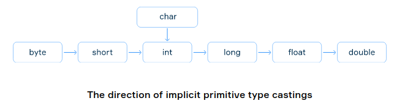

# Type cast

## Introduction

Java provides two kinds of casting for primitive types: implicit and explicit. The first one is performed automatically by the java compiler when it is possible, and the second one – only by a programmer.

## Implicit casting

The compiler automatically performs implicit casting when the target type is wider than the source type. The picture below illustrates the direction of this casting. Any value of a given type can be assigned to the one on the right implicitly.

Normally, there is no loss of information when the target type is wider than the source type, for example when we cast int to long. But it is not possible to automatically cast in the backward order (e.g. from long to int or from double to float).



### Bit lossy

When we convert an int to float, or a long to float or to double, we may lose some less significant bits of the value, which will result in the loss of precision. However, the result of this conversion will be a correctly rounded version of the integer value, which will be in the overall range of the target type.

```java
long bigLong =  1_200_000_002L;
float bigFloat = bigLong; // 1.2E9 (= 1_200_000_000)
```

### Char → Int

- check ASCII codes table [here](https://ascii.cl/)

```java
char character = 'a';
char upperCase = 'A';

int ascii1 = character; // this is 97
int ascii2 = upperCase; // this is 65
```

Strictly speaking, Java uses Unicode Character Representations (UTF-16), which is a superset of ASCII and includes a by far larger set of symbols. However, the numbers 0–127 have the same values in ASCII and Unicode.

## Explicit casting

To perform explicit casting, a programmer must write the target type in parentheses before the source.

```java
(target type) source
```

```java
double d = 2.00003;

// it loses the fractional part
long l =  (long) d; // 2

// type overflow
long bigNum = 100_000_000_000_000L;
int n = (int) bigNum; // 276447232
```
