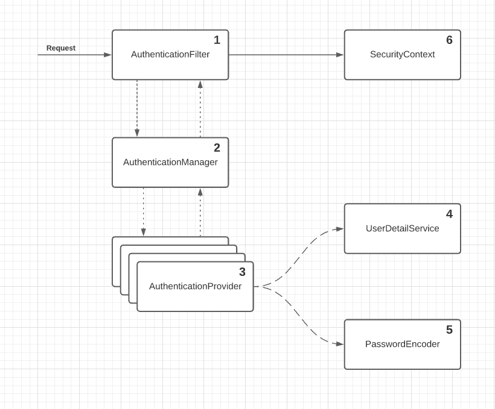

# Default Spring Security Configuration

## Overall architecture

- The authentication filter delegates the authentication request to the authentication manager and, based on the
  response, configures the security context
- The authentication manager uses the authentication provider to process authentication
- The authentication provider implements the authentication logic
- The user details service implements user management responsibility, which the authentication provider uses in the
  authentication logic
- The password encoder implements the password management, which the authentication provider uses in the authentication
  logic
- The security context keeps the authentication data after the authentication process

### OBS

- The AuthenticationFilter is actually a hole filter chain, but in this diagram, it will be represented as a unit for
  simplicity
- Basic authentication only requires the client to send a username and a password through the HTTP `Authorization`
  header.

## Contracts

**`UserDetailsService` →** manages the details about uses

**`PasswordEncoder` →** Encodes a password and verifies if the password matches an existing encoding.

**`AuthenticationProvider` →** defines the authentication logic, delegating the user and password management