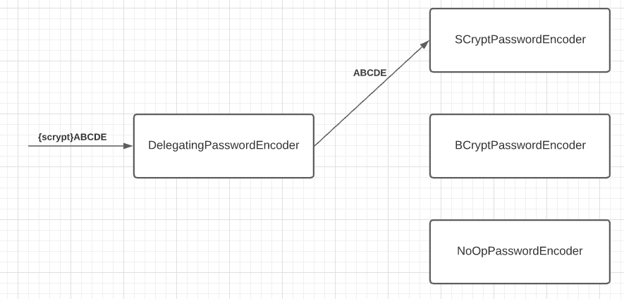

# Spring Security Passwords

## The PasswordEncoder contract

- The `AuthenticationProvider` uses the `PasswordEncoder` to validate the user's password in the authentication process.

```java
public interface PasswordEncoder {

  String encode(CharSequence rawPassword);

  boolean matches(CharSequence rawPassword, String encodedPassword);

  default boolean upgradeEncoding(String encodedPassword) { 
    return false; 
  }
}
```

### Provided Implementation

Spring Security provides some options of PasswordEncoder implementations:

- `NoOpPasswordEncoder` → Doesn't encode the password but keeps it in cleartext. Used only for * examples
- `StandardPasswordEncoder` → Uses SHA-256 to hash the password. This implementation is deprecated now.
- `Pbkdf2PasswordEncoder` → Uses the password-based key derivation function 2 (PBKDF2)
- `BCryptPasswordEncoder` → Uses a bcrypt strong hashing function to encode the password.
- `SCryptPasswordEncoder` → Uses an scrypt hashing function to encode the password.


Book about hashing [link](https://www.manning.com/books/real-world-cryptography)

### Some basic implementations

```java
public class Sha512PasswordEncoder implements PasswordEncoder {

  @Override
  public String encode(CharSequence rawPassword) {
    return hashWithSHA512(rawPassword.toString());
  }

  @Override
  public boolean matches(CharSequence rawPassword, String encodedPassword) {
    String hashedPassword = encode(rawPassword);
    return encodedPassword.equals(hashedPassword);
  }

  private String hashWithSHA512(String input) {

	  StringBuilder result = new StringBuilder();

	  try {
	    MessageDigest md = MessageDigest.getInstance("SHA-512");
	    byte [] digested = md.digest(input.getBytes());
	    for (int i = 0; i < digested.length; i++) {
	       result.append(Integer.toHexString(0xFF & digested[i]));
	    }
	  } catch (NoSuchAlgorithmException e) {
	    throw new RuntimeException("Bad algorithm");
	  }

	  return result.toString();
	}

}
```

## Multiple Encoding Strategies

Scenario: The application in production uses an hashing algorithm X. Somebody finds a vulnerability in the currently used algorithm (X) so the developers need to change it for an algorithm Y and use it only on new users. A good choice for that is to use a `DelegatingPasswordEncoder` object.

### The `DelegatingPasswordEncoder` solution

- The delegating password encoder object has a map to each password encoder available, so it knows based on the key with password encoder should be used.
- OBS: Spring provides a convinient way of create a delegating passwor encoder. The class `PasswordEncoderFactories` provides a static method that returns an implementation of the `DelegatingPasswordEncoder`



- Create an instance of `DelegatingPasswordEncoder`

```java
@Configuration
public class ProjectConfig {

  // Omitted code

  @Bean
  public PasswordEncoder passwordEncoder() {
    Map<String, PasswordEncoder> encoders = new HashMap<>();

    encoders.put("noop", NoOpPasswordEncoder.getInstance());
    encoders.put("bcrypt", new BCryptPasswordEncoder());
    encoders.put("scrypt", new SCryptPasswordEncoder());

    return new DelegatingPasswordEncoder("bcrypt", encoders);
  }
}
```