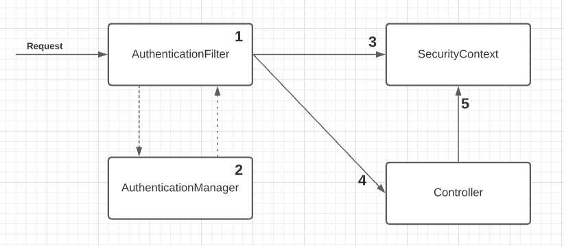

# Spring security SecurityContext

Once the `AuthenticationManager` completes the authentication process successfully, it stores the `Authentication` instance for the rest of the request. The instance storing the `Authentication` object is called the security context.



1. The user makes a request that is intercepted by the authentication filter
2. The authentication filter delegates the authentication responsibility to the authentication manager
3. Once the request is authenticated, the details are stored in the security context
4. The authentication filter delegates to the controller
5. The controller can now use the details from the security context

## The SecurityContext

```java
public interface SecurityContext extends Serializable {

  Authentication getAuthentication();
  void setAuthentication(Authentication authentication);
}
```

### Managing the SecurityContext

Spring Security offers three strategies to manage the `SecurityContext` with an object in the role of a manager. It’s named the `SecurityContextHolder`:

`MODE_THREADLOCAL` → Allows each thread to store its own details in the security context. In a thread-per-request web application, this is a common approach as each request has an individual thread. Spring Security uses `ThreadLocal` to manage the context.

`MODE_INHERITABLETHREADLOCAL` → Similar to MODE_THREADLOCAL but also instructs Spring Security to copy the security context to the next thread in case of an asynchronous method. This way, we can say that the new thread running the `@Async` method inherits the security context. These work only when the framework creates the threads (if the developer creates a thread, the spring security does not know about the thread).

`MODE_GLOBAL` → Makes all the threads of the application see the same security context instance. `SecurityContext` **is not thread-safe**, so the developer should take care of concurrent access

### Propagating the Security Context

- Both make sure to copy the current security context  for the thread that executes the task.

`DelegatingSecurityContextRunnable` → Use these to decorate the taks you want to execute on a separate thread. It extends `Runnable` , so use it only when there is no return value expected

`DelegatingSecurityContextCallable<T>` → Use these when there is a return value expected

Example:

```java
@GetMapping("/ciao")
public String ciao() throws Exception {
  Callable<String> task = () -> {
      SecurityContext context = SecurityContextHolder.getContext();
      return context.getAuthentication().getName();
  };

  ExecutorService e = Executors.newCachedThreadPool();
  try {
     return "Ciao, " + e.submit(task).get() + "!";
  } finally {
     e.shutdown();
  }
}

@GetMapping("/hola")
public String hola() throws Exception {
  Callable<String> task = () -> {
    SecurityContext context = SecurityContextHolder.getContext();
    return context.getAuthentication().getName();
  };

  ExecutorService e = Executors.newCachedThreadPool();
  e = new DelegatingSecurityContextExecutorService(e);
  try {
    return "Hola, " + e.submit(task).get() + "!";
  } finally {
    e.shutdown();
  }
}
```